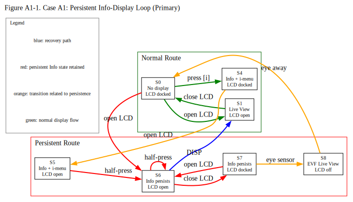
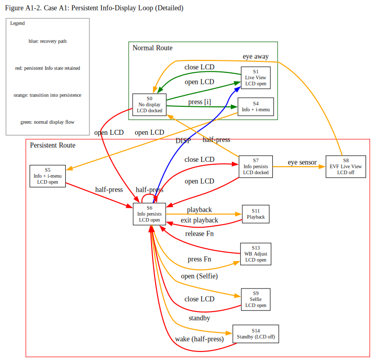

# Case A1: Schrödinger's Sisyphean Loop (Firmware Ver. 3.01)

## Revision History
| Rev. | Date | Description |
| :--- | :--- | :--- |
| 1.0  | 2026-04-20 | Initial report. 
| 1.1  | 2026-04-29 | Added verification that DISP button cannot restore the display while the LCD is closed (docked). 
| 1.2  | 2026-04-29 | Strictly distinguished between "[i] menu" and "Information display" in all test steps. Fixed inconsistency in Step 67. 
| 1.3  | 2026-04-30 | Clarified "Close" definition and removed redundant S0 reference in Setup to clarify state transitions. Changed the expression "Display [i] menu" to "Press [i] button". Added Steps 11 to 16. 
| 1.4  | 2026-05-01 | Title Update: Renamed the anomaly to "Schrödinger’s Sisyphean Loop".This better characterizes the non-deterministic nature of the UI: the return-path from the S3 (Menu) remains in a "superposition" of S1 (Live View) and S6 (Info-display), which collapses into an endless Sisyphean return to the Info-display once a setting is changed.
| 1.5  | 2026-05-04 | Added State S17, 18. Introduced the "Next State" column to all steps to better visualize unexpected state transitions and provide a more rigorous tracking of the Sisyphean loop. Refined the state definitions in the state transition table.
| 1.6  | 2026-05-14 |  Refined operational assessment criteria (E/N/M) and added display-control context definitions to distinguish user-observable behavior from inferred display-control consistency. 
| 1.7  | 2026-05-19 | Added Operational Notes. 
| 1.8  | 2026-05-20 | Partial correction of the table. 

---

## 1. Core Observation

*   **Phenomenon:** 
    - A shutter button half-press frequently fails to return the system to Live View, leaving the LCD locked on the Info screen.
    - The state persists across power cycles and long-term battery removal (10+ minutes).
*   **Core Issue:** 
    The Info screen appears to enter a “reject” state for standard operational inputs. Escape routes are limited and may be unintentionally disabled through user customization without warning.

### Figure 

Source: [`Case_A1_Figure1.dot`](../../figures/Case_A1_Figure1.dot)

Source: [`Case_A1_Figure2.dot`](../../figures/Case_A1_Figure2.dot)

---

## 2. Preparation and Settings

1. Start with a memory card that already contains saved images. If none are saved, take a picture to create and save image data.
2. Begin with the LCD monitor docked (folded into the body) with the screen facing you.
3. Initialize all camera settings. 
4. Attach a native Z-mount lens, an F-mount lens via FTZ, or a non-CPU manual focus lens, and remove the lens cap, as no lens-specific variations were observed in my scope of testing.
5. In [CUSTOM SETTINGS MENU] > [c3 Power off delay], set each item to the maximum duration.
6. In SETUP MENU > Limit monitor mode selection, select ONLY "Prioritize viewfinder (1 or 2)."
7. In SETUP MENU > Automatic monitor display switch, set it to "On (when monitor docked)."
8. Exit the menu so that nothing is displayed on the LCD monitor.
9. To avoid interference with the verification process, adjust the shutter speed as necessary so that it remains faster than approximately 1/60 s.
10. Power off, then on; wait 10 s.

---

## 3. Experimental Contexts
### Display Control Contexts
- **Context A**
  - [Monitor mode] = Prioritize viewfinder (1 or 2)
  - [Automatic monitor display switch] = On (when monitor docked)
- **Context B**
  - [Monitor mode] = Automatic display switch
  - [Automatic monitor display switch] = On
  - Factory default configuration
- **Context C**
  - [Monitor mode] = Monitor only
- **Context D**
  - [Monitor mode] = Prioritize viewfinder (1 or 2)
  - LCD monitor inactive due to EVF priority activation
- **Context E**
  - [Monitor mode] = Automatic display switch
  - [Automatic monitor display switch] = On (when monitor docked)

> [!NOTE]
> **Context D** represents a temporary display-routing condition in which Live View is assigned to the EVF and the LCD monitor becomes inactive due to EVF-priority behavior. Under this condition, previously observed Info persistence behavior was not maintained while Live View routing remained EVF-active.

### Assessment Codes
> For details on the evaluation ratings (E / N / M), please refer to the [Assessment Codes](../../README.md#assessment-codes) in the main README.

---

## 4. State Transition Table (Definition B)

> [!NOTE]
> Some states defined in this document are visually indistinguishable
> from one another, yet exhibit different operational behavior
> depending on prior display-routing history and monitor context.

### Operational Notes

- Unless otherwise specified, “LCD monitor open (less than 180°)” refers to opening the monitor to at least 30° but less than 180° (to avoid entering self-portrait mode), while keeping the LCD active and allowing viewfinder status checks without triggering the eye sensor.

- Unless otherwise specified, keep your eye and other objects away from the viewfinder to prevent eye sensor activation.

- Unless otherwise specified, perform each operation with an interval of at least three seconds between actions.

- Throughout this table, “closing the LCD” refers to returning the monitor to the docked position with the screen facing the user, as defined in the initial setup.

- WB = White balance.

| Step | Current State | Operation                                                     | Next State | LCD Status                                  | EVF Status | My Assessment | Your Assessment             |
| :--- | :------------ | :------------------------------------------------------------ | :--------- | :------------------------------------------ | :------------------ | :----- | :-------- |
| Context A                                                                                                                                |            |                                                                                               |                   |                                              |                   |                              |                 |
| 1    | S0            | Open LCD monitor                                              | S1         | Live View display                           | Off                 |   E    | E / N / M |
| 2    | S1            | Close LCD monitor                                             | S0         | No display                                  | Off                 |   E    | E / N / M |
| 3    | S0            | Press [MENU] button                                           | S2         | Menu display                                | Off                 |   E    | E / N / M |
| 4    | S2            | Open LCD monitor                                              | S3         | Menu display                                | Off                 |   E    | E / N / M |
| 5    | S3            | Half-press shutter button                                     | S1         | Live View display                           | Off                 |   E    | E / N / M |
| 6    | S1            | Close LCD monitor                                             | S0         | No display                                  | Off                 |   E    | E / N / M |
| 7    | S0            | Press [i] button                                              | S4         | Info display with [i] menu overlay          | Off                 |   E    | E / N / M |
| 8    | S4            | Open LCD monitor                                              | S5         | Info display with [i] menu overlay          | Off                 |   E    | E / N / M |
| 9    | S5            | Half-press shutter button                                     | S6         | Info display                                | Off                 | **N**  | E / N / M |
| 10   | S6            | Close LCD monitor                                             | S7         | Info display                                | Off                 | **N**  | E / N / M |
| 11   | S7            | Power off; wait 3 s, then turn on and wait 10 s               | S0         | No display                                  | Off                 |   E    | E / N / M |
| 12   | S0            | Press [i] button                                              | S4         | Info display with [i] menu overlay          | Off                 |   E    | E / N / M |
| 13   | S4            | Press [i] button                                              | S7         | Info display                                | Off                 |   E    | E / N / M |
| 14   | S7            | Open LCD monitor                                              | S6         | Info display                                | Off                 |   E    | E / N / M |
| 15   | S6            | Half-press shutter button                                     | S6         | Info display                                | Off                 | **N**  | E / N / M |
| 16   | S6            | Close LCD monitor                                             | S7         | Info display                                | Off                 | **N**  | E / N / M |
| Context D                                                                                                                                |            |                                                                                               |                   |                                              |                   |                              |                 |
| 17   | S7            | Look into the EVF                                             | S8         | No display                                  | Live View display   |   E    | E / N / M |
| Context A                                                                                                                                |            |                                                                                               |                   |                                              |                   |                              |                 |
| 18   | S8            | Move eye away from EVF                                        | S0         | No display                                  | Off                 |   E    | E / N / M |
| 19   | S0            | Open LCD monitor                                              | S6         | Info display                                | Off                 | **N**  | E / N / M |
| 20   | S6            | Close LCD monitor                                             | S7         | Info display                                | Off                 | **N**  | E / N / M |
| 21   | S7            | Half-press shutter button                                     | S0         | No display                                  | Off                 |   E    | E / N / M |
| 22   | S0            | Open LCD monitor                                              | S6         | Info display                                | Off                 | **N**  | E / N / M |
| 23   | S6            | Open LCD monitor to selfie position                           | S9         | Live View display (Selfie)                  | Off                 |   E    | E / N / M |
| 24   | S9            | Move LCD monitor back to less than 180 degrees                | S6         | Info display                                | Off                 | **N**  | E / N / M |
| 25   | S6            | Close LCD monitor                                             | S7         | Info display                                | Off                 | **N**  | E / N / M |
| 26   | S7            | Press [MENU] button                                           | S2         | Menu display                                | Off                 |   E    | E / N / M |
| 27   | S2            | Open LCD monitor                                              | S3         | Menu display                                | Off                 |   E    | E / N / M |
| 28   | S3            | Half-press shutter button                                     | S6         | Info display                                | Off                 | **N**  | E / N / M |
| 29   | S6            | Close LCD monitor                                             | S7         | Info display                                | Off                 | **N**  | E / N / M |
| 30   | S7            | Power off; wait 10 s, then turn on and wait 10 s              | S0         | No display                                  | Off                 |   E    | E / N / M |
| 31   | S0            | Open LCD monitor                                              | S6         | Info display                                | Off                 | **N**  | E / N / M |
| 32   | S6            | Close LCD monitor                                             | S7         | Info display                                | Off                 | **N**  | E / N / M |
| 33   | S7            | Press playback button                                         | S10        | Images stored on the memory card displayed  | Off                 |   E    | E / N / M |
| 34   | S10           | Press playback button                                         | S0         | No display                                  | Off                 |   E    | E / N / M |
| 35   | S0            | Open LCD monitor                                              | S6         | Info display                                | Off                 | **N**  | E / N / M |
| 36   | S6            | Press playback button                                         | S11        | Images stored on the memory card displayed  | Off                 |   E    | E / N / M |
| 37   | S11           | Press playback button                                         | S6         | Info display                                | Off                 | **N**  | E / N / M |
| 38   | S6            | Close LCD monitor                                             | S7         | Info display                                | Off                 | **N**  | E / N / M |
| 39   | S7            | Half-press shutter button                                     | S0         | No display                                  | Off                 |   E    | E / N / M |
| 40   | S0            | Press and hold the Fn button                                  | S12        | White balance adjustment displayed          | Off                 |   E    | E / N / M |
| 41   | S12           | Release the Fn button                                         | S7         | Info display                                | Off                 | **N**  | E / N / M |
| 42   | S7            | Half-press shutter button                                     | S0         | No display                                  | Off                 |   E    | E / N / M |
| 43   | S0            | Open LCD monitor                                              | S6         | Info display                                | Off                 | **N**  | E / N / M |
| 44   | S6            | Press and hold the Fn button                                  | S13        | White balance adjustment displayed          | Off                 | **M**  | E / N / M |
| 45   | S13           | Release the Fn button                                         | S6         | Info display                                | Off                 | **N**  | E / N / M |
| 46   | S6            | Close LCD monitor                                             | S7         | Info display                                | Off                 | **N**  | E / N / M |
| 47   | S7            | Power off -> battery removal -> wait 10 min -> reinstall -> Power on            | S0         | No display                                  | Off                 |   E    | E / N / M |
| 48   | S0            | Open LCD monitor                                              | S6         | Info display                                | Off                 | **N**  | E / N / M |
| 49   | S6            | Close LCD monitor                                             | S7         | Info display                                | Off                 | **N**  | E / N / M |
| 50   | S7            | Power off, then on; wait 10 s                                 | S0         | No display                                  | Off                 |   E    | E / N / M |
| 51   | S0            | Press and hold the Fn button                                  | S12        | White balance adjustment displayed          | Off                 |   E    | E / N / M |
| 52   | S12           | Release the Fn button                                         | S7         | Info display                                | Off                 | **N**  | E / N / M |
| 53   | S7            | Half-press shutter button                                     | S0         | No display                                  | Off                 |   E    | E / N / M |
| 54   | S0            | Power off                                                     | S0         | No display                                  | Off                 |   E    | E / N / M |
| 55   | S0            | Open LCD monitor                                              | S14        | No display                                  | Off                 |   E    | E / N / M |
| 56   | S14           | Power on                                                      | S6         | Info display                                | Off                 | **N**  | E / N / M |
| 57   | S6            | Press the DISP button                                         | S1         | Live View display                           | Off                 |   E    | E / N / M |
| 58   | S1            | Close LCD monitor                                             | S0         | No display                                  | Off                 |   E    | E / N / M |
| 59   | S0            | Open LCD monitor                                              | S1         | Live View display                           | Off                 |   E    | E / N / M |
| 60   | S1            | Close LCD monitor                                             | S0         | No display                                  | Off                 |   E    | E / N / M |
| 61   | S0            | Press [i] button                                              | S4         | Info display with [i] menu overlay          | Off                 |   E    | E / N / M |
| 62   | S4            | Open LCD monitor                                              | S5         | Info display with [i] menu overlay          | Off                 |   E    | E / N / M |
| 63   | S5            | Half-press shutter button                                     | S6         | Info display                                | Off                 | **N**  | E / N / M |
| 64   | S6            | Close LCD monitor                                             | S7         | Info display                                | Off                 | **N**  | E / N / M |
| 65   | S7            | Press the DISP button                                         | S0         | No display                                  | Off                 |   E    | E / N / M |
| 66   | S0            | Open LCD monitor                                              | S6         | Info display                                | Off                 | **N**  | E / N / M |
| 67   | S6            | Press the DISP button                                         | S1         | Live View display                           | Off                 |   E    | E / N / M |
| 68   | S1            | Press and hold the Fn button                                  | S15        | Live View with the WB adjustment overlay    | Off                 |   E    | E / N / M |
| 69   | S15           | Release the Fn button                                         | S1         | Live View display                           | Off                 |   E    | E / N / M |
| 70   | S1            | Close LCD monitor                                             | S0         | No display                                  | Off                 |   E    | E / N / M |
| 71   | S0            | Look into the EVF                                             | S8         | No display                                  | Live View display   |   E    | E / N / M |
| 72   | S8            | Press and hold the Fn button                                  | S16        | No display                                  | Live View display with the WB adjustment overlay |   E    | E / N / M |
| 73   | S16           | Release the Fn button                                         | S8         | No display                                  | Live View display   |   E    | E / N / M |
| 74   | S8            | Move eye away from EVF                                        | S0         | No display                                  | Off                 |   E    | E / N / M |
| 75   | S0            | Power off; wait 3 s, then turn on and wait 10 s               | S0         | No display                                  | Off                 |   E    | E / N / M |
| 76   | S0            | Open LCD monitor                                              | S1         | Live View display                           | Off                 |   E    | E / N / M |
| 77   | S1            | Close LCD monitor                                             | S0         | No display                                  | Off                 |   E    | E / N / M |
| 78   | S0            | Press [i] button; wait 1 s                                    | S4         | Info display with [i] menu overlay          | Off                 |   E    | E / N / M |
| 79   | S4            | Open LCD monitor; wait 1 s                                    | S5         | Info display with [i] menu overlay          | Off                 |   E    | E / N / M |
| 80   | S5            | Half-press shutter button                                     | S6         | Info display                                | Off                 | **N**  | E / N / M |
| 81   | S6            | Press the DISP button                                         | S1         | Live View display                           | Off                 |   E    | E / N / M |
| 82   | S1            | Close LCD monitor                                             | S0         | No display                                  | Off                 |   E    | E / N / M |
| 83   | S0            | Power off; wait 3 s, then turn on and wait 10 s               | S0         | No display                                  | Off                 |   E    | E / N / M |
| 84   | S0            | Open LCD monitor                                              | S1         | Live View display                           | Off                 |   E    | E / N / M |
| 85   | S1            | Close LCD monitor                                             | S0         | No display                                  | Off                 |   E    | E / N / M |
| 86   | S0            | Press [i] button; wait 10 s                                   | S4         | Info display with [i] menu overlay          | Off                 |   E    | E / N / M |
| 87   | S4            | Open LCD monitor; wait 10 s                                   | S5         | Info display with [i] menu overlay          | Off                 |   E    | E / N / M |
| 88   | S5            | Half-press shutter button                                     | S6         | Info display                                | Off                 | **N**  | E / N / M |
| 89   | S6            | Press the DISP button                                         | S1         | Live View display                           | Off                 |   E    | E / N / M |
| 90   | S1            | Close LCD monitor                                             | S0         | No display                                  | Off                 |   E    | E / N / M |
| 91   | S0            | Power off; wait 3 s, then turn on and wait 10 s               | S0         | No display                                  | Off                 |   E    | E / N / M |
| 92   | S0            | Open LCD monitor                                              | S1         | Live View display                           | Off                 |   E    | E / N / M |
| 93   | S1            | Close LCD monitor                                             | S0         | No display                                  | Off                 |   E    | E / N / M |
| 94   | S0            |In [CUSTOM SETTINGS MENU] > [c3 Power off delay], set Standby timer to 10 s, then exit | S0         | No display                                  | Off                 |   E    | E / N / M |
| 95   | S0            | Press [i] button                                              | S4         | Info display with [i] menu overlay          | Off                 |   E    | E / N / M |
| 96   | S4            | Open LCD monitor                                              | S5         | Info display with [i] menu overlay          | Off                 |   E    | E / N / M |
| 97   | S5            | Half-press shutter button                                     | S6         | Info display                                | Off                 | **N**  | E / N / M |
| 98   | S6            | Wait until the standby timer activates and   the LCD goes dark , then wait another 1 s                     | S14        | No display                                  | Off                 |   E   | E / N / M |
| 99   | S14           | Half-press shutter button                                     | S6         | Info display                                | Off                 | **N**  | E / N / M |
| 100  | S6            | Press the DISP button                                         | S1         | Live View display                           | Off                 |   E    | E / N / M |
| 101  | S1            | Close LCD monitor                                             | S0         | No display                                  | Off                 |   E    | E / N / M |
| 102  | S0            | Power off; wait 3 s, then turn on and wait 10 s               | S0         | No display                                  | Off                 |   E    | E / N / M |
| 103  | S0            | Open LCD monitor                                              | S1         | Live View display                           | Off                 |   E    | E / N / M |
| 104  | S1            | Close LCD monitor                                             | S0         | No display                                  | Off                 |   E    | E / N / M |
| 105  | S0            | Press [i] button                                              | S4         | Info display with [i] menu overlay          | Off                 |   E    | E / N / M |
| 106  | S4            | Open LCD monitor                                              | S5         | Info display with [i] menu overlay          | Off                 |   E    | E / N / M |
| 107  | S5            | Half-press shutter button                                     | S6         | Info display                                | Off                 | **N**  | E / N / M |
| 108  | S6            | Wait until the standby timer activates and   the LCD goes dark , then wait another 1 s                     | S14        | No display                                  | Off                 |   E    | E / N / M |
| 109   | S14          | Half-press shutter button                                     | S6         | Info display                                | Off                 | **N**  | E / N / M |
| 110   | S6           | Press the DISP button                                         | S1         | Live View display                           | Off                 |   E    | E / N / M |
| 111  | S1            | Close LCD monitor                                             | S0         | No display                                  | Off                 |   E    | E / N / M |
| 112  | S0            | Power off; wait 3 s, then turn on and wait 10 s               | S0         | No display                                  | Off                 |   E    | E / N / M |
| 113  | S0            | Open LCD monitor                                              | S1         | Live View display                           | Off                 |   E    | E / N / M |
| 114  | S1            | Close LCD monitor                                             | S0         | No display                                  | Off                 |   E    | E / N / M |
| 115  | S0            | Press [i] button                                              | S4         | Info display with [i] menu overlay          | Off                 |   E    | E / N / M |
| 116  | S4            | Open LCD monitor                                              | S5         | Info display with [i] menu overlay          | Off                 |   E    | E / N / M |
| 117  | S5            | Half-press shutter button                                     | S6         | Info display                                | Off                 | **N**  | E / N / M |
| 118  | S6            | Wait until the standby timer activates and   the LCD goes dark , then wait another 10 s                     | S14        | No display                                  | Off                 |   E    | E / N / M |
| 119  | S14           | Half-press shutter button                                     | S6         | Info display                                | Off                 | **N**  | E / N / M |
| 120  | S6            | Press the DISP button                                         | S1         | Live View display                           | Off                 |   E    | E / N / M |
| 121  | S1            | Close LCD monitor                                             | S0         | No display                                  | Off                 |   E    | E / N / M |
| 122  | S0            | Power off; wait 3 s, then turn on and wait 10 s               | S0         | No display                                  | Off                 |   E    | E / N / M |
| 123  | S0            | Open LCD monitor                                              | S1         | Live View display                           | Off                 |   E    | E / N / M |
| 124  | S1            | Close LCD monitor                                             | S0         | No display                                  | Off                 |   E    | E / N / M |
| 125  | S0            | Press [i] button                                              | S4         | Info display with [i] menu overlay          | Off                 |   E    | E / N / M |
| 126  | S4            | Open LCD monitor                                              | S5         | Info display with [i] menu overlay          | Off                 |   E    | E / N / M |
| 127  | S5            | Half-press shutter button                                     | S6         | Info display                                | Off                 | **N**  | E / N / M |
| 128  | S6            | Half-press the shutter button as soon as the LCD is fully dark| S6         | Info display                                | Off                 | **N**  | E / N / M |
| 129  | S6            | Press the DISP button                                         | S1         | Live View display                           | Off                 |   E    | E / N / M |
| 130  | S1            | Close LCD monitor                                             | S0         | No display                                  | Off                 |   E    | E / N / M |
| 131  | S0            | Power off; wait 3 s, then turn on and wait 10 s               | S0         | No display                                  | Off                 |   E    | E / N / M |
| 132  | S0            | Open LCD monitor                                              | S1         | Live View display                           | Off                 |   E    | E / N / M |
| 133  | S1            | Close LCD monitor                                             | S0         | No display                                  | Off                 |   E    | E / N / M |
| 134  | S0            |In [CUSTOM SETTINGS MENU] > [c3 Power off delay], set Standby timer to No limit, then exit | S0         | No display                                  | Off                 |   E    | E / N / M |
| 135  | S0            | Press [i] button                                              | S4         | Info display with [i] menu overlay          | Off                 |   E    | E / N / M |
| 136  | S4            | Open LCD monitor                                              | S5         | Info display with [i] menu overlay          | Off                 |   E    | E / N / M |
| 137  | S5            | Half-press shutter button                                     | S6         | Info display                                | Off                 | **N**  | E / N / M |
| 138  | S6            | Close LCD monitor                                             | S0         | No display                                  | Off                 |   E    | E / N / M |
| 139  | S0            | Power off                                                     | S0         | No display                                  | Off                 |   E    | E / N / M |
| 140  | S0            | remove the memory card; no specific timing is required        | S0         | No display                                  | Off                 |   E    | E / N / M |
| 141  | S0            | Power on;wait 10 s                                            | S0         | No display                                  | Off                 |   E    | E / N / M |
| 142  | S0            | Open LCD monitor                                              | S6         | Info display                                | Off                 | **N**  | E / N / M |
| 143  | S6            | Press the DISP button                                         | S1         | Live View display                           | Off                 |   E    | E / N / M |
| 144  | S1            | Close LCD monitor                                             | S0         | No display                                  | Off                 |   E    | E / N / M |
| 145  | S0            | Power off                                                     | S0         | No display                                  | Off                 |   E    | E / N / M |
| 146  | S0            | Reinsert the memory card; no specific timing is required      | S0         | No display                                  | Off                 |   E    | E / N / M |
| 147  | S0            | Power on;wait 10 s                                            | S0         | No display                                  | Off                 |   E    | E / N / M |
| 148  | S0            | Open LCD monitor                                              | S1         | Live View display                           | Off                 |   E    | E / N / M |
| 149  | S1            | Close LCD monitor                                             | S0         | No display                                  | Off                 |   E    | E / N / M |
| 150  | S0            | Press [i] button                                              | S4         | Info display with [i] menu overlay          | Off                 |   E    | E / N / M |
| 151  | S4            | Open LCD monitor                                              | S5         | Info display with [i] menu overlay          | Off                 |   E    | E / N / M |
| 152  | S5            | Half-press shutter button                                     | S6         | Info display                                | Off                 | **N**  | E / N / M |
| 153  | S6            | Press the shutter button all the way down to capture an image; no specific timing is required  | S6         | Info display                                | Off                 | **N**  | E / N / M |
| 154  | S6            | Press playback button                                         | S11        | Images stored on the memory card displayed  | Off                 |   E    | E / N / M |
| 155  | S11           | Press playback button                                         | S6         | Info display                                | Off                 | **N**  | E / N / M |
| 156  | S6            | Close LCD monitor                                             | S0         | No display                                  | Off                 |   E    | E / N / M |

---

### Observational Notes
Work in progress.

### Observed Recovery Paths

The following operations were observed to terminate,
bypass, or prevent persistent Info-display states
under at least some tested conditions:

- Pressing DISP while the LCD monitor remained active
- Reassigning the "DISP Cycle view info display" function
  to a custom button and then pressing it
  (not to be confused with "Live view info display off")
- Disabling "Display 5" in:
  [CUSTOM SETTINGS MENU] >
  [d19 Custom monitor shooting display]
- Initializing camera settings

