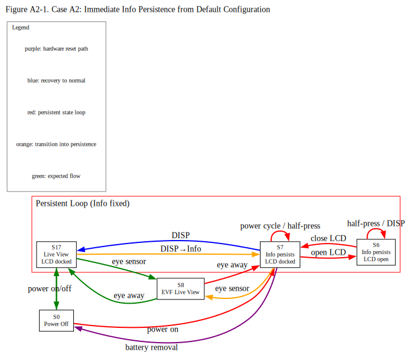

# Case A2: Deterministic Loop: Immediate Transition from Default Settings (Firmware Ver. 3.01)

## Revision History
| Rev. | Date | Description |
| :--- | :--- | :--- |
| 1.0 | 2026-05-04 | Initial report. |
| 1.1 | 2026-05-05 | Added Thought experiment. |
| 1.2 | 2026-05-06 | Added states. Refined the title to more accurately reflect the inevitable progression from factory settings to the inescapable state. |
| 1.3 | 2026-05-14 | Refined operational assessment criteria (E/N/M) and added display-control context definitions to distinguish user-observable behavior from inferred display-control consistency. 

---

## 1. Core Observation

* **Phenomenon:**
    Immediate Info-display persistence can be triggered by a minimal operation immediately after initialization. Furthermore, depending on subsequent configurations, user customization may unintentionally restrict or eliminate immediate escape routes without warning.

* **Core Issue:**
    A minimal operation can transition the system from a factory-default state into a persistent Info-display loop. Furthermore, it was verified that this persistent state can degrade into an effectively inescapable loop even under configuration profiles different from those observed in Case A1.

### Figure 

Source: [`Case_A2_Figure1.dot`](../../figures/Case_A2_Figure1.dot)

This figure focuses on the first half of Case A2, where Info-display persistence is entered immediately from the factory-default display configuration. Later observations involving Monitor only mode and restricted recovery paths are described in the transition table rather than in this simplified diagram.

---

## 2. Preparation and Settings

1. Begin with the LCD monitor docked (folded into the body) with the screen facing you.
2. Initialize all camera settings.
3. Attach a native Z-mount lens, an F-mount lens via FTZ, or a non-CPU manual focus lens, and remove the lens cap, as no lens-specific variations were observed in my scope of testing.
4. In [CUSTOM SETTINGS MENU] > [c3 Power off delay], set each item to the maximum duration.
5. To avoid interference with the verification process, adjust the shutter speed as necessary so that it remains faster than approximately 1/60 s.
6. Power off.

---

## 3. Experimental Contexts
### Display Control Contexts
- **Context A**
  - [Monitor mode] = Prioritize viewfinder (1 or 2)
  - [Automatic monitor display switch] = On (when monitor docked)
- **Context B**
  - [Monitor mode] = Automatic display switch
  - [Automatic monitor display switch] = On
  - Factory default configuration
- **Context C**
  - [Monitor mode] = Monitor only
- **Context D**
  - [Monitor mode] = Prioritize viewfinder (1 or 2)
  - LCD monitor inactive due to EVF priority activation
- **Context E**
  - [Monitor mode] = Automatic display switch
  - [Automatic monitor display switch] = On (when monitor docked)

> [!NOTE]
> **Context D** represents a temporary display-routing condition in which Live View is assigned to the EVF and the LCD monitor becomes inactive due to EVF-priority behavior. Under this condition, previously observed Info persistence behavior was not maintained while Live View routing remained EVF-active.

### Assessment Codes
> For details on the evaluation ratings (E / N / M), please refer to the [Assessment Codes](../../README.md#assessment-codes) in the main README.
---

## 4. State Transition Table

| Step | Current State | Operation                                                     | Next State | LCD Status                                  | EVF Status          | My Assessment | Your Assessment             |
| :--- | :------------ | :------------------------------------------------------------ | :--------- | :------------------------------------------ | :------------------ | :------------ | :------------- |
| Context B                                                                                                                                |            |                                                                                               |                   |                                              |                   |                              |                 |
| 1    | S0            | Power on                                                      | S17        | Live View display                           | Off                 |   E   | E / N / M |
| 2    | S17           | Press DISP button repeatedly until Info display is shown      | S7         | Info display                                | Off                 |   E   | E / N / M |
| 3    | S7            | Power off, then on                                            | S7         | Info display                                | Off                 | **N** | E / N / M |
| 4    | S7            | Half-press shutter button                                     | S7         | Info display                                | Off                 | **N** | E / N / M |
| 5    | S7            | Look into the EVF                                             | S8         | Nothing display                             | Live View display   |   E   | E / N / M |
| 6    | S8            | Move eye away from EVF                                        | S7         | Info display                                | Off                 | **N** | E / N / M |
| 7    | S7            | Open LCD monitor                                              | S6         | Info display                                | Off                 | **N** | E / N / M |
| 8    | S6            | Half-press shutter button                                     | S6         | Info display                                | Off                 | **N** | E / N / M |
| 9    | S6            | Close LCD monitor                                             | S7         | Info display                                | Off                 | **N** | E / N / M |
| 10   | S7            | Press the DISP button                                         | S17        | Live View display                           | Off                 |   E   | E / N / M |
| 11   | S17           | Open LCD monitor                                              | S1         | Live View display                           | Off                 |   E   | E / N / M |
| 12   | S1            | Close LCD monitor                                             | S17        | Live View display                           | Off                 |   E   | E / N / M |
| 13   | S17           | Power off, then on                                            | S17        | Live View display                           | Off                 |   E   | E / N / M |
| 14   | S17           | Press DISP button repeatedly until Info display is shown      | S7         | Info display                                | Off                 |   E   | E / N / M |
| 15   | S7            | Power off, then on                                            | S7         | Info display                                | Off                 | **N** | E / N / M |
| Context C                                                                                         |            |                                                                                               |                   |                                              |                   |                              |                 |
| 16   | S7            | In [SETUP MENU] > [Limit monitor mode selection],  select ONLY "Monitor only", then exit | S7 | Info display                                | Off                 | **N** | E / N / M |
| 17   | S7            | In [CUSTOM SETTINGS MENU] > [f2 Custom controls (shooting)],  set DISP button  to "OFF None", then exit| S7 | Info display                                | Off                 | **N** | E / N / M |
| 18   | S7            | Power off, then on                                            | S7         | Info display                                | Off                 | **N** | E / N / M |
| 19   | S7            | Half-press shutter button                                     | S7         | Info display                                | Off                 | **N** | E / N / M |
| 20   | S7            | Look into the EVF                                             | S7         | Info display                                | Off                 |   E   | E / N / M |
| 21   | S7            | Move eye away from EVF                                        | S7         | Info display                                | Off                 | **N** | E / N / M |
| 22   | S7            | Open LCD monitor                                              | S6         | Info display                                | Off                 | **N** | E / N / M |
| 23   | S6            | Half-press shutter button                                     | S6         | Info display                                | Off                 | **N** | E / N / M |
| 24   | S6            | Close LCD monitor                                             | S7         | Info display                                | Off                 | **N** | E / N / M |
| 25   | S7            | Press the DISP button                                         | S7         | Info display                                | Off                 | **M** | E / N / M |
| 26   | S7            | Open LCD monitor                                              | S6         | Info display                                | Off                 | **N** | E / N / M |
| 27   | S6            | Press the DISP button                                         | S6         | Info display                                | Off                 | **M** | E / N / M |
| 28   | S6            | Close LCD monitor                                             | S7         | Info display                                | Off                 | **N** | E / N / M |
| 29   | S7            | Press and hold the Fn button                                  | S12        | WB adjustment displayed          | Off                 |   E   | E / N / M |
| 30   | S12           | Release the Fn button                                         | S7         | Info display                                | Off                 | **N** | E / N / M |
| 31   | S7            | Power off, then on                                            | S7         | Info display                                | Off                 | **N** | E / N / M |
| 32   | S7            | Half-press shutter button                                     | S7         | Info display                                | Off                 | **N** | E / N / M |
| 33   | S7            | Power off, then on                                            | S7         | Info display                                | Off                 | **N** | E / N / M |
| 34   | S7            | Half-press shutter button                                     | S7         | Info display                                | Off                 | **N** | E / N / M |
| 35   | S7            | Power off -> battery removal -> wait 10 min -> reinstall      | S0         | Nothing display                             | Off                 |   E   | E / N / M |
| 36   | S0            | Power on                                                      | S7         | Info display                                | Off                 | **N** | E / N / M |
| 37   | S7            | Power off                                                     | S0         | Nothing display                             | Off                 |   E   | E / N / M |

---
### Observational Notes
Work in progress.

---

### Observed Recovery Paths

The following operations were observed to terminate,
bypass, or prevent persistent Info-display states
under at least some tested conditions:

- Pressing DISP while the LCD monitor remained active
- Reassigning the "DISP Cycle view info display" function
  to a custom button and then pressing it
  (not to be confused with "Live view info display off")
- Disabling "Display 5" in:
  [CUSTOM SETTINGS MENU] >
  [d19 Custom monitor shooting display]
- Initializing camera settings

