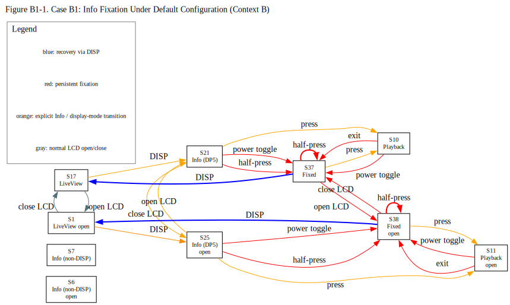
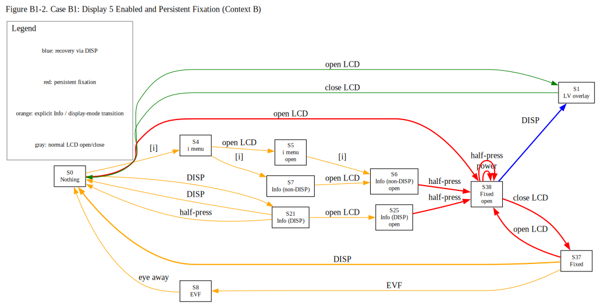
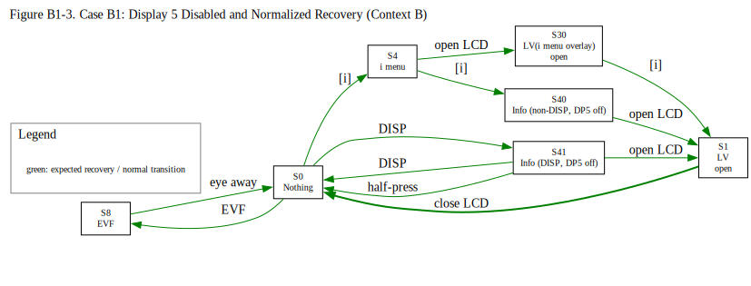

# Case B1: The Shadow Double (Firmware Ver. 3.01)

## Revision History
| Rev. | Date | Description |
| :--- | :--- | :--- |
| 1.0 | 2026-05-07 | Initial report. |
| 1.1 | 2026-05-08 | Refined the state definitions in the state transition table. |
| 1.2 | 2026-05-09 | Added State S35-S36, Steps 185–251, and "Preparation and Settings" Item 9. |
| 1.3 | 2026-05-11 | Added "Preparation and Settings" Item 10. |
| 1.4 | 2026-05-14 | Refined operational assessment criteria (E/N/M) and added display-control context definitions to distinguish user-observable behavior from inferred display-control consistency. |
| 1.5 | 2026-05-21 | Added state definitions S37 and S38, and revised S6, S7, S21, and S25. Concurrently updated the relevant tables. |
| 1.6 | 2026-05-22 | Added state definitions S39 and S42, and revised S6, S7, S21, S37 and S38. Concurrently updated the relevant tables. Added Steps 252–277|

---

### 1. Core Observation

### [Case B1: The Shadow Double](./Case_B1_Shadow_Double.md)
*   **Phenomenon:**
    - In addition to explicit physical operations via the DISP button, the "Info display" can appear independently of the photographer's intent.
    - Furthermore, while it remains the exact same screen, it possesses multiple display pathways; for instance, it can be selected as "Display 5" for the live shooting screen.
    - Depending on the specific display pathway, the LCD may become locked on the Info display, subsequent to which it fails to accept a halfway shutter press to return to the live view.
    - Moreover, unless the exact pathway is retraced backward, it is impossible to predict externally whether a halfway shutter press will successfully transition to the live view or leave the screen locked on the Info display.
    - This section presents the results of observing these multi-faceted characteristics of the Info display.
*   **Core Issue:**
    The Info display possesses multiple activation pathways, some of which lock the LCD and render subsequent shutter actions unpredictable from the outside.

### Figure B1-1. Info Fixation Under Default Configuration

Source: [`Case_B1_Figure1.dot`](../../figures/Case_B1_Figure1.dot)

The diagram focuses on Steps 1-126, 222-277.

This figure summarizes the default-configuration observations in which explicitly selected Display 5 Info states (S21/S25) collapse into persistent fixation states (S37/S38) after operations such as half-press, power cycling, or playback exit.

The purpose of this figure is not to show all state transitions, but to highlight how visually similar Info displays diverge operationally depending on route and persistence behavior.

### Figure B1-2. Display 5 Enabled and Persistent Fixation

Source: [`Case_B1_Figure2.dot`](../../figures/Case_B1_Figure2.dot)

The diagram focuses on Steps 156–196, excluding Step 187.

This figure summarizes the Context B observations after Display 5 was re-enabled. Under this condition, both explicit DISP-route Info states and non-DISP Info states could collapse into persistent fixation states. 

### Figure B1-3. Display 5 Disabled and Normalized Recovery

Source: [`Case_B1_Figure3.dot`](../../figures/Case_B1_Figure3.dot)

The diagram focuses on Steps 127–155, 197-207.

This figure summarizes the Context B observations after Display 5 was disabled. Under the same display-routing environment that previously allowed persistent fixation, the Info-like states observed with Display 5 disabled returned through expected transitions such as DISP, half-press, LCD opening, and [i] menu dismissal.

The result suggests that Display 5 plays a central role in the persistent fixation behavior observed in the corresponding Display 5 enabled sequences.

---

## 2. Preparation and Settings

1. Ensure a memory card with saved images is inserted. (If none exist, capture an image first.)
2. Keep the LCD monitor docked (folded into the body) with the screen facing you.
3. Initialize all camera settings.
4. Attach a native Z-mount lens, an F-mount lens via FTZ, or a non-CPU manual focus lens, and remove the lens cap, as no lens-specific variations were observed in my scope of testing.
5. In **[CUSTOM SETTINGS MENU] > [c3 Power off delay]**, set each item to the maximum duration.
6. Use the Monitor mode button to set it to **Automatic display switch** (default).
7. In [CUSTOM SETTINGS MENU] > [d19 Custom monitor shooting display], ensure that all displays (Display 1 to 5) are checked and Display 1 is selected (default).
8. In **[CUSTOM SETTINGS MENU] > [d19 Custom monitor shooting display]**, configure each display as follows to easily identify which display number is currently active.
    * **Display 2:** Uncheck all items, then check only [Histogram].
    * **Display 3:** Uncheck all items, then check only [Framing grid].
    * **Display 4:** Uncheck all items, then check only [Center indicator].
    * *Finally, ensure that each box for Display 1 through Display 5 itself is checked.*
9. In **[CUSTOM SETTINGS MENU] > [d20 Custom viewfinder shooting display]**, apply the same settings as the monitor for the same identification purpose.
    * **Display 2:** Uncheck all items, then check only [Histogram].
    * **Display 3:** Uncheck all items, then check only [Framing grid].
    * **Display 4:** Uncheck all items, then check only [Center indicator].
    * *Finally, ensure that each box for Display 1 through Display 4 itself is checked.*
10. To avoid interference with the verification process, adjust the shutter speed as necessary so that it remains faster than approximately 1/60 s.
11. Power off.

---

## 3. Experimental Contexts
### Display Control Contexts
- **Context A**
  - [Monitor mode] = Prioritize viewfinder (1 or 2)
  - [Automatic monitor display switch] = On (when monitor docked)
- **Context B**
  - [Monitor mode] = Automatic display switch
  - [Automatic monitor display switch] = On
  - Factory default configuration
- **Context C**
  - [Monitor mode] = Monitor only
- **Context D**
  - [Monitor mode] = Prioritize viewfinder (1 or 2)
  - LCD monitor inactive due to EVF priority activation
- **Context E**
  - [Monitor mode] = Automatic display switch
  - [Automatic monitor display switch] = On (when monitor docked)

> [!NOTE]
> **Context D** represents a temporary display-routing condition in which Live View is assigned to the EVF and the LCD monitor becomes inactive due to EVF-priority behavior. Under this condition, previously observed Info persistence behavior was not maintained while Live View routing remained EVF-active.

---

### Assessment Codes

> [!NOTE]
> For details on the evaluation ratings (E / N / M), please refer to the [Assessment Codes](../../README.md#assessment-codes) in the main README.

---

## 4. State Transition Table (Definition B)

> [!NOTE]
> Some states defined in this document are visually indistinguishable
> from one another, yet exhibit different operational behavior
> depending on prior display-routing history and monitor context.

> [!NOTE]
> “DP5 ON” indicates that Display 5 (Info display) is enabled in
> [d19 Custom monitor shooting display].
>
> “DP5 OFF” indicates that Display 5 is disabled in the same menu,
> even though visually similar Info-like displays may still appear
> through other operational routes.
>
> “explicit DISP route” refers to states reached directly through
> DISP-button cycling.
>
> “non-DISP route” refers to visually similar states reached through
> other operational paths such as Fn release, power-cycle return,
> LCD opening/closing, or other display-routing behavior.
>
> “persistent fixation” refers to states in which the Info display
> remains or reappears after interruption, regardless of the original
> entry route.

### Operational Notes

- Unless otherwise specified, “LCD monitor open (less than 180°)” refers to opening the monitor to at least 30° but less than 180° (to avoid entering self-portrait mode), while keeping the LCD active and allowing viewfinder status checks without triggering the eye sensor.

- Unless otherwise specified, keep your eye and other objects away from the viewfinder to prevent eye sensor activation.

- Unless otherwise specified, perform each operation with an interval of at least three seconds between actions.

- Throughout this table, “closing the LCD” refers to returning the monitor to the docked position with the screen facing the user, as defined in the initial setup.

- WB = White balance.

| Step | Current State | Operation                                                            | Next State | LCD Status                               | EVF Status                               | My Assessment                             | Your Assessment              |
| :--- | :------------ | :------------------------------------------------------------ | :--------- | :------------------------------------------ | :------------------ | :------------ | :-------------------------- |
| **Context B**                                                                                    |            |                                                                                               |                   |                                              |                   |                              |                 |
| 1    | S0             | Power on                                                                     | S17         | Live View with the Display 1 overlay          | Off                                        |   E   | E / N / M |
| 2    | S17            | Press the DISP button                                                        | S18         | Live View with the Display 2 overlay          | Off                                        |   E   | E / N / M |
| 3    | S18            | Press the DISP button                                                        | S19         | Live View with the Display 3 overlay          | Off                                        |   E   | E / N / M |
| 4    | S19            | Press the DISP button                                                        | S20         | Live View with the Display 4 overlay          | Off                                        |   E   | E / N / M |
| 5    | S20            | Press the DISP button                                                        | S21         | Info display (explicit DISP route; DP5 ON)    | Off                                        |   E   | E / N / M |
| 6    | S21            | Press the DISP button                                                        | S17         | Live View with the Display 1 overlay          | Off                                        |   E   | E / N / M |
| 7    | S17            | Open LCD monitor                                                             | S1          | Live View with the Display 1 overlay          | Off                                        |   E   | E / N / M |
| 8    | S1             | Press the DISP button                                                        | S22         | Live View with the Display 2 overlay          | Off                                        |   E   | E / N / M |
| 9    | S22            | Press the DISP button                                                        | S23         | Live View with the Display 3 overlay          | Off                                        |   E   | E / N / M |
| 10   | S23            | Press the DISP button                                                        | S24         | Live View with the Display 4 overlay          | Off                                        |   E   | E / N / M |
| 11   | S24            | Press the DISP button                                                        | S25         | Info display (explicit DISP route; DP5 ON)    | Off                                        |   E   | E / N / M |
| 12   | S25            | Press the DISP button                                                        | S1          | Live View with the Display 1 overlay          | Off                                        |   E   | E / N / M |
| 13   | S1             | Close LCD monitor                                                            | S17         | Live View with the Display 1 overlay          | Off                                        |   E   | E / N / M |
| 14   | S17            | Look into the EVF                                                            | S8          | Nothing display                               | Live View with the Display 1 overlay       |   E   | E / N / M |
| 15   | S8             | Press the DISP button                                                        | S26         | Nothing display                               | Live View with the Display 2 overlay       |   E   | E / N / M |
| 16   | S26            | Press the DISP button                                                        | S27         | Nothing display                               | Live View with the Display 3 overlay       |   E   | E / N / M |
| 17   | S27            | Press the DISP button                                                        | S28         | Nothing display                               | Live View with the Display 4 overlay       |   E   | E / N / M |
| 18   | S28            | Press the DISP button                                                        | S8          | Nothing display                               | Live View with the Display 1 overlay       |   E   | E / N / M |
| 19   | S8             | Move eye away from EVF                                                       | S17         | Live View with the Display 1 overlay          | Off                                        |   E   | E / N / M |
| 20   | S17            | Power off, then on                                                           | S17         | Live View with the Display 1 overlay          | Off                                        |   E   | E / N / M |
| 21   | S17            | Press the DISP button                                                        | S18         | Live View with the Display 2 overlay          | Off                                        |   E   | E / N / M |
| 22   | S18            | Power off -> battery removal -> wait 10 min -> reinstall -> Power on         | S18         | Live View with the Display 2 overlay          | Off                                        |   E   | E / N / M |
| 23   | S18            | Press DISP button repeatedly until Display 5=Info is shown                   | S21         | Info display (explicit DISP route; DP5 ON)    | Off                                        |   E   | E / N / M |
| 24   | S21            | Power off -> battery removal -> wait 10 min -> reinstall -> Power on         | S37         | Info display (persistent fixation)            | Off                                        | **M** | E / N / M |
| 25   | S37            | Half-press shutter button                                                    | S37         | Info display (persistent fixation)            | Off                                        | **N** | E / N / M |
| 26   | S37            | Open LCD monitor                                                             | S38         | Info display (persistent fixation)            | Off                                        | **N** | E / N / M |
| 27   | S38            | Half-press shutter button                                                    | S38         | Info display (persistent fixation)            | Off                                        | **N** | E / N / M |
| 28   | S38            | Close LCD monitor                                                            | S37         |  Info display (persistent fixation)           | Off                                        | **N** | E / N / M |
| 29   | S37            | Press the DISP button                                                        | S17         | Live View with the Display 1 overlay          | Off                                        |   E   | E / N / M |
| 30   | S17            | Power off, then on                                                           | S17         | Live View with the Display 1 overlay          | Off                                        |   E   | E / N / M |
| 31   | S17            | Press and hold the Fn button                                                 | S32         | Live View with the WB adjustment overlay      | Off                                        |   E   | E / N / M |
| 32   | S32            | Release the Fn button                                                        | S17         | Live View with the Display 1 overlay          | Off                                        |   E   | E / N / M |
| 33   | S17            | Open LCD monitor                                                             | S1          | Live View with the Display 1 overlay          | Off                                        |   E   | E / N / M |
| 34   | S1             | Press and hold the Fn button                                                 | S15         | Live View with the WB adjustment overlay      | Off                                        |   E   | E / N / M |
| 35   | S15            | Release the Fn button                                                        | S1          | Live View with the Display 1 overlay          | Off                                        |   E   | E / N / M |
| 36   | S1             | Close LCD monitor                                                            | S17         | Live View with the Display 1 overlay          | Off                                        |   E   | E / N / M |
| 37   | S17            | Look into the EVF                                                            | S8          | Nothing display                               | Live View with the Display 1 overlay       |   E   | E / N / M |
| 38   | S8             | Press and hold the Fn button                                                 | S16         | Nothing display                               | Live View with the WB adjustment overlay   |   E   | E / N / M |
| 39   | S16            | Release the Fn button                                                        | S8          | Nothing display                               | Live View with the Display 1 overlay       |   E   | E / N / M |
| 40   | S8             | Move eye away from EVF                                                       | S17         | Nothing display                               | Live View with the Display 1 overlay       |   E   | E / N / M |
| 41   | S17            | Press the DISP button                                                        | S18         | Live View with the Display 2 overlay          | Off                                        |   E   | E / N / M |
| 42   | S18            | Press and hold the Fn button                                                 | S32         | Live View with the WB adjustment overlay      | Off                                        |   E   | E / N / M |
| 43   | S32            | Release the Fn button                                                        | S18         | Live View with the Display 2 overlay          | Off                                        |   E   | E / N / M |
| 44   | S18            | Open LCD monitor                                                             | S22         | Live View with the Display 2 overlay          | Off                                        |   E   | E / N / M |
| 45   | S22            | Press and hold the Fn button                                                 | S15         | Live View with the WB adjustment overlay      | Off                                        |   E   | E / N / M |
| 46   | S15            | Release the Fn button                                                        | S22         | Live View with the Display 2 overlay          | Off                                        |   E   | E / N / M |
| 47   | S22            | Close LCD monitor                                                            | S18         | Live View with the Display 2 overlay          | Off                                        |   E   | E / N / M |
| 48   | S18            | Look into the EVF                                                            | S8          | Nothing display                               | Live View with the Display 1 overlay       |   E   | E / N / M |
| 49   | S8             | Press and hold the Fn button                                                 | S16         | Nothing display                               | Live View with the WB adjustment overlay   |   E   | E / N / M |
| 50   | S16            | Release the Fn button                                                        | S8          | Nothing display                               | Live View with the Display 1 overlay       |   E   | E / N / M |
| 51   | S8             | Move eye away from EVF                                                       | S18         | Live View with the Display 2 overlay          | Off                                        |   E   | E / N / M |
| 52   | S18            | Press DISP button repeatedly until Display 5=Info is shown                   | S21         | Info display (explicit DISP route; DP5 ON)    | Off                                        |   E   | E / N / M |
| 53   | S21            | Press and hold the Fn button                                                 | S12         | Only the WB adjustment overlay                | Off                                        |   E   | E / N / M |
| 54   | S12            | Release the Fn button                                                        | S21         | Info display (explicit DISP route; DP5 ON)    | Off                                        |   E   | E / N / M |
| 55   | S21            | Open LCD monitor                                                             | S25         | Info display (explicit DISP route; DP5 ON)    | Off                                        |   E   | E / N / M |
| 56   | S25            | Press and hold the Fn button                                                 | S13         | Only the WB adjustment overlay                | Off                                        |   E   | E / N / M |
| 57   | S13            | Release the Fn button                                                        | S25         | Info display (explicit DISP route; DP5 ON)    | Off                                        |   E   | E / N / M |
| 58   | S25            | Close LCD monitor                                                            | S21         | Info display (explicit DISP route; DP5 ON)    | Off                                        |   E   | E / N / M |
| 59   | S21            | Look into the EVF                                                            | S8          | Nothing display                               | Live View with the Display 1 overlay       |   E   | E / N / M |
| 60   | S8             | Press and hold the Fn button                                                 | S16         | Nothing display                               | Live View with the WB adjustment overlay   |   E   | E / N / M |
| 61   | S16            | Release the Fn button                                                        | S8          | Nothing display                               | Live View with the Display 1 overlay       |   E   | E / N / M |
| 62   | S8             | Move eye away from EVF                                                       | S21         | Info display (explicit DISP route; DP5 ON)    | Off                                        |   E   | E / N / M |
| 63   | S21            | Press DISP button repeatedly until Display 2 is shown                        | S18         | Live View with the Display 2 overlay          | Off                                        |   E   | E / N / M |
| 64   | S18            | Press [i] button                                                             | S29         | Live View with [i] menu overlay               | Off                                        |   E   | E / N / M |
| 65   | S29            | Press [i] button                                                             | S18         | Live View with the Display 2 overlay          | Off                                        |   E   | E / N / M |
| 66   | S18            | Open LCD monitor                                                             | S22         | Live View with the Display 2 overlay          | Off                                        |   E   | E / N / M |
| 67   | S22            | Press [i] button                                                             | S30         | Live View with [i] menu overlay               | Off                                        |   E   | E / N / M |
| 68   | S30            | Press [i] button                                                             | S22         | Live View with the Display 2 overlay          | Off                                        |   E   | E / N / M |
| 69   | S22            | Close LCD monitor                                                            | S18         | Live View with the Display 2 overlay          | Off                                        |   E   | E / N / M |
| 70   | S18            | Look into the EVF                                                            | S8          | Nothing display                               | Live View with the Display 1 overlay       |   E   | E / N / M |
| 71   | S8             | Press [i] button                                                             | S31         | Nothing display                               | Live View with [i] menu overlay            |   E   | E / N / M |
| 72   | S31            | Press [i] button                                                             | S8          | Nothing display                               | Live View with the Display 1 overlay       |   E   | E / N / M |
| 73   | S8             | Move eye away from EVF                                                       | S18         | Live View with the Display 2 overlay          | Off                                        |   E   | E / N / M |
| 74   | S18            | Press DISP button repeatedly until Display 5 is shown                        | S21         | Info display (explicit DISP route; DP5 ON)    | Off                                        |   E   | E / N / M |
| 75   | S21            | Press [i] button                                                             | S33         | Info display (explicit DISP route; DP5 ON)   with [i] menu overlay | Off                                        |   E   | E / N / M |
| 76   | S33            | Press [i] button                                                             | S21         | Info display (explicit DISP route; DP5 ON)    || Off                                        |   E   | E / N / M |
| 77   | S21            | Open LCD monitor                                                             | S25         | Info display (explicit DISP route; DP5 ON)    || Off                                        |   E   | E / N / M |
| 78   | S25            | Press [i] button                                                             | S34         | Info display (explicit DISP route; DP5 ON)    with [i] menu overlay | Off                                        |   E   | E / N / M |
| 79   | S34            | Press [i] button                                                             | S25         | Info display (explicit DISP route; DP5 ON)    | Off                                        |   E   | E / N / M |
| 80   | S25            | Close LCD monitor                                                            | S21         | Info display (explicit DISP route; DP5 ON)    | Off                                        |   E   | E / N / M |
| 81   | S21            | Look into the EVF                                                            | S8          | Nothing display                               | Live View with the Display 1 overlay       |   E   | E / N / M |
| 82   | S8             | Press [i] button                                                             | S31         | Nothing display                               | Live View with [i] menu overlay            |   E   | E / N / M |
| 83   | S31            | Press [i] button                                                             | S8          | Nothing display                               | Live View with the Display 1 overlay       |   E   | E / N / M |
| 84   | S8             | Move eye away from EVF                                                       | S21         | Info display (explicit DISP route; DP5 ON)    | Off                                        |   E   | E / N / M |
| 85   | S21            | Look into the EVF                                                            | S8          | Nothing display                               | Live View with the Display 1 overlay       |   E   | E / N / M |
| 86   | S8             | Press the DISP button                                                        | S26         | Nothing display                               | Live View with the Display 2 overlay       |   E   | E / N / M |
| 87   | S26            | Move eye away from EVF                                                       | S21         | Info display (explicit DISP route; DP5 ON)    | Off                                        |   E   | E / N / M |
| 88   | S21            | Look into the EVF                                                            | S26         | Nothing display                               | Live View with the Display 2 overlay       |   E   | E / N / M |
| 89   | S26            | Press the DISP button                                                        | S27         | Nothing display                               | Live View with the Display 3 overlay       |   E   | E / N / M |
| 90   | S27            | Move eye away from EVF                                                       | S21         | Info display (explicit DISP route; DP5 ON)    | Off                                        |   E   | E / N / M |
| 91   | S21            | Look into the EVF                                                            | S27         | Nothing display                               | Live View with the Display 3 overlay       |   E   | E / N / M |
| 92   | S27            | Press the DISP button                                                        | S28         | Nothing display                               | Live View with the Display 4 overlay       |   E   | E / N / M |
| 93   | S28            | Move eye away from EVF                                                       | S21         | Info display (explicit DISP route; DP5 ON)    | Off                                        |   E   | E / N / M |
| 94   | S21            | Look into the EVF                                                            | S28         | Nothing display                               | Live View with the Display 4 overlay       |   E   | E / N / M |
| 95   | S28            | Press the DISP button                                                        | S8          | Nothing display                               | Live View with the Display 1 overlay       |   E   | E / N / M |
| 96   | S8             | Move eye away from EVF                                                       | S21         | Info display (explicit DISP route; DP5 ON)    | Off                                        |   E   | E / N / M |
| 97   | S21            | Press the DISP button                                                        | S17         | Live View with the Display 1 overlay          | Off                                        |   E   | E / N / M |
| 98   | S17            | Power off, then on                                                           | S17         | Live View with the Display 1 overlay          | Off                                        |   E   | E / N / M |
| 99   | S17            | In [CUSTOM SETTINGS MENU] > [d19 Custom monitor shooting display], select only Display 1,   ensuring Display 5 and others are unchecked,then exit | S17 | Live View | Off |   E   | E / N / M |
| 100  | S17            | Press and hold the Fn button                                                 | S32         | Live View with the WB adjustment overlay      | Off                                        |   E   | E / N / M |
| 101  | S32            | Release the Fn button                                                        | S17         | Live View with the Display 1 overlay          | Off                                        |   E   | E / N / M |
| 102  | S17            | Open LCD monitor                                                             | S1          | Live View with the Display 1 overlay          | Off                                        |   E   | E / N / M |
| 103  | S1             | Press and hold the Fn button                                                 | S15         | Live View with the WB adjustment overlay      | Off                                        |   E   | E / N / M |
| 104  | S15            | Release the Fn button                                                        | S1          | Live View with the Display 1 overlay          | Off                                        |   E   | E / N / M |
| 105  | S1             | Close LCD monitor                                                            | S17         | Live View with the Display 1 overlay          | Off                                        |   E   | E / N / M |
| 106  | S17            | Press [i] button                                                             | S29         | Live View with [i] menu overlay               | Off                                        |   E   | E / N / M |
| 107  | S29            | Press [i] button                                                             | S17         | Live View with the Display 1 overlay          | Off                                        |   E   | E / N / M |
| 108  | S17            | Open LCD monitor                                                             | S1          | Live View with the Display 1 overlay          | Off                                        |   E   | E / N / M |
| 109  | S1             | Press [i] button                                                             | S30         | Live View with [i] menu overlay               | Off                                        |   E   | E / N / M |
| 110  | S30            | Press [i] button                                                             | S1          | Live View with the Display 1 overlay          | Off                                        |   E   | E / N / M |
| 111  | S1             | Close LCD monitor                                                            | S17         | Live View with the Display 1 overlay          | Off                                        |   E   | E / N / M |
| 112  | S17            | Power off, then on                                                           | S17         | Live View with the Display 1 overlay          | Off                                        |   E   | E / N / M |
| ** Context E**                                                                                                                                |            |                                                                                               |                   |                                              |                   |                              |                 |
| 113  | S17            | In [SETUP MENU] > [Automatic monitor display switch], set it to "On (when monitor docked)", then exit | S17 | Live View | Off |   E   | E / N / M |
| 114  | S17            | Press and hold the Fn button                                                 | S32         | Live View with the WB adjustment overlay      | Off                                        |   E   | E / N / M |
| 115  | S32            | Release the Fn button                                                        | S17         | Live View with the Display 1 overlay          | Off                                        |   E   | E / N / M |
| 116  | S17            | Open LCD monitor                                                             | S1          | Live View with the Display 1 overlay          | Off                                        |   E   | E / N / M |
| 117  | S1             | Press and hold the Fn button                                                 | S15         | Live View with the WB adjustment overlay      | Off                                        |   E   | E / N / M |
| 118  | S15            | Release the Fn button                                                        | S1          | Live View with the Display 1 overlay          | Off                                        |   E   | E / N / M |
| 119  | S1             | Close LCD monitor                                                            | S17         | Live View with the Display 1 overlay          | Off                                        |   E   | E / N / M |
| 120  | S17            | Press [i] button                                                             | S29         | Live View with [i] menu overlay               | Off                                        |   E   | E / N / M |
| 121  | S29            | Press [i] button                                                             | S17         | Live View with the Display 1 overlay          | Off                                        |   E   | E / N / M |
| 122  | S17            | Open LCD monitor                                                             | S1          | Live View with the Display 1 overlay          | Off                                        |   E   | E / N / M |
| 123  | S1             | Press [i] button                                                             | S30         | Live View with [i] menu overlay               | Off                                        |   E   | E / N / M |
| 124  | S30            | Press [i] button                                                             | S1          | Live View with the Display 1 overlay          | Off                                        |   E   | E / N / M |
| 125  | S1             | Close LCD monitor                                                            | S17         | Live View with the Display 1 overlay          | Off                                        |   E   | E / N / M |
| 126  | S17            | Power off, then on                                                           | S17         | Live View with the Display 1 overlay          | Off                                        |   E   | E / N / M |
| **Context A**                                                                                    |            |                                                                                               |                   |                                              |                   |                              |                 |
| 127  | S17            | In [SETUP MENU] > [Limit monitor mode selection],  select ONLY "Prioritize viewfinder  (1 or 2)", then exit | S0 | Nothing display | Off |   E   | E / N / M |
| 128  | S0             | Power off, then on                                                           | S0          | Nothing display                               | Off                                        |   E   | E / N / M |
| 129  | S0             | Press the DISP button                                                        | S41         |Info-like display (explicit DISP route; DP5 OFF)| Off                                        |   E   | E / N / M |
| 130  | S41            | Press the DISP button                                                        | S0          | Nothing display                               | Off                                        |   E   | E / N / M |
| 131  | S0             | Press the DISP button                                                        | S41         |Info-like display (explicit DISP route; DP5 OFF)| Off                                        |   E   | E / N / M |
| 132  | S41            | Half-press shutter button                                                    | S0          | Nothing display                               | Off                                        |   E   | E / N / M |
| 133  | S0             | Press the DISP button                                                        | S41         |Info-like display (explicit DISP route; DP5 OFF)| Off                                        |   E   | E / N / M |
| 134  | S21            | Power off, then on                                                           | S0          | Nothing display                               | Off                                        |   E   | E / N / M |
| 135  | S0             | Press the DISP button                                                        | S41         | Info-like display (explicit DISP route; DP5 OFF)| Off                                        |   E   | E / N / M |
| 136  | S41            | Open LCD monitor                                                             | S1         | Live View with the Display 1 overlay          | Off                                        |   E   | E / N / M |
| 137  | S1             | Press the DISP button                                                        | S1          | Live View with the Display 1 overlay          | Off                                        |   E   | E / N / M |
| 138  | S1             | Close LCD monitor                                                            | S0          | Nothing display                               | Off                                        |   E   | E / N / M |
| 139  | S0             | Power off, then on                                                           | S0          | Nothing display                               | Off                                        |   E   | E / N / M |
| 140  | S0             | Press and hold the Fn button                                                 | S12         | Only the WB adjustment overlay                | Off                                        |   E   | E / N / M |
| 141  | S12            | Release the Fn button                                                        | S40         | Info-like display (non-DISP route; DP5 OFF)   | Off                                        |   E   | E / N / M |
| 142  | S40             | Press the DISP button                                                        | S0          | Nothing display                               | Off                                        |   E   | E / N / M |
| 143  | S0             | Power off, then on                                                           | S0          | Nothing display                               | Off                                        |   E   | E / N / M |
| 144  | S0             | Press and hold the Fn button                                                 | S12         | Only the WB adjustment overlay                | Off                                        |   E   | E / N / M |
| 145  | S12            | Release the Fn button                                                        | S40         | Info-like display (non-DISP route; DP5 OFF)   | Off                                        |   E   | E / N / M |
| 146  | S40             | Half-press shutter button                                                    | S0          | Nothing display                               | Off                                        |   E   | E / N / M |
| 147  | S0             | Power off, then on                                                           | S0          | Nothing display                               | Off                                        |   E   | E / N / M |
| 148  | S0             | Press and hold the Fn button                                                 | S12         | Only the WB adjustment overlay                | Off                                        |   E   | E / N / M |
| 149  | S12            | Release the Fn button                                                        | S40         | Info-like display (non-DISP route; DP5 OFF)   | Off                                        |   E   | E / N / M |
| 150  | S7             | Power off, then on                                                           | S0          | Nothing display                               | Off                                        |   E   | E / N / M |
| 151  | S0             | Press and hold the Fn button                                                 | S12         | Only the WB adjustment overlay                | Off                                        |   E   | E / N / M |
| 152  | S12            | Release the Fn button                                                        | S40          | Info-like display (non-DISP route; DP5 OFF)   | Off                                        |   E   | E / N / M |
| 153  | S40            | Open LCD monitor                                                             | S1          | Live View with the Display 1 overlay          | Off                                        |   E   | E / N / M |
| 154  | S1             | Close LCD monitor                                                            | S0          | Nothing display                               | Off                                        |   E   | E / N / M |
| 155  | S0             | Power off, then on                                                           | S0          | Nothing display                               | Off                                        |   E   | E / N / M |
| 156  | S0             | In [CUSTOM SETTINGS MENU] > [d19 Custom monitor shooting display],   select Display 1 and Display 5,then exit | S0 | Nothing display | Off |   E   | E / N / M |
| 157  | S0             | Power off, then on                                                           | S0          | Nothing display                               | Off                                        |   E   | E / N / M |
| 158  | S0             | Press the DISP button                                                        | S21         | Info display (explicit DISP route; DP5 ON)    | Off                                        |   E   | E / N / M |
| 159  | S21            | Press the DISP button                                                        | S0          | Nothing display                               | Off                                        |   E   | E / N / M |
| 160  | S0             | Press the DISP button                                                        | S21         | Info display (explicit DISP route; DP5 ON)   | Off                                        |   E   | E / N / M |
| 161  | S21             | Half-press shutter button                                                   | S0          | Nothing display                               | Off                                        |   E   | E / N / M |
| 162  | S0             | Press the DISP button                                                        | S21         | Info display (explicit DISP route; DP5 ON)    | Off                                        |   E   | E / N / M |
| 163  | S21            | Power off, then on                                                           | S0          | Nothing display                               | Off                                        |   E   | E / N / M |
| 164  | S0             | Press the DISP button                                                        | S21         | Info display (explicit DISP route; DP5 ON)    | Off                                        |   E   | E / N / M |
| 165  | S21            | Open LCD monitor                                                             | S25         | Info display (explicit DISP route; DP5 ON)    | Off                                        |   E   | E / N / M |
| 166  | S25            | Half-press shutter button                                                    | S38         | Info display (persistent fixation)            | Off                                        | **N** | E / N / M |
| 167  | S38            | Power off, then on                                                           | S38         | Info display (persistent fixation)            | Off                                        | **N** | E / N / M |
| 168  | S38            | Close LCD monitor                                                            | S37         | Info display (persistent fixation)            | Off                                        | **N** | E / N / M |
| 169  | S37            | Look into the EVF                                                            | S8         | Nothing display                               | Live View with the Display 1 overlay       |   E   | E / N / M |
| 170  | S8             | Move eye away from EVF                                                       | S0          | Nothing display                               | Off                                        |   E   | E / N / M |
| 171  | S0             | Power off, then on                                                           | S0          | Nothing display                               | Off                                        |   E   | E / N / M |
| 172  | S0             | Open LCD monitor                                                             | S38         | Info display (persistent fixation)            | Off                                        | **N** | E / N / M |
| 173  | S38            | Close LCD monitor                                                            | S37         | Info display (persistent fixation)            | Off                                        | **N** | E / N / M |
| 174  | S37            | Press the DISP button                                                        | S0          | Nothing display                               | Off                                        |   E   | E / N / M |
| 175  | S0             | Power off, then on                                                           | S0          | Nothing display                               | Off                                        |   E   | E / N / M |
| 176  | S0             | Open LCD monitor                                                             | S38         | Info display (persistent fixation)            | Off                                        | **N** | E / N / M |
| 177  | S38            | Press the DISP button                                                        | S1          | Live View with the Display 1 overlay          | Off                                        |   E   | E / N / M |
| 178  | S1             | Close LCD monitor                                                            | S0          | Nothing display                               | Off                                        |   E   | E / N / M |
| 179  | S0             | Power off, then on                                                           | S0          | Nothing display                               | Off                                        |   E   | E / N / M |
| 180  | S0             | Press [i] button                                                             | S4          | Info display (non-DISP route; DP5 ON)   y with [i] menu overlay            | Off                                        |   E   | E / N / M |
| 181  | S4             | Press [i] button                                                             | S7          | Info display (non-DISP route; DP5 ON)         | Off                                        |   E   | E / N / M |
| 182  | S7             | Open LCD monitor                                                             | S6          | Info display (non-DISP route; DP5 ON)         | Off                                        |   E   | E / N / M |
| 183  | S6             | Half-press shutter button                                                    | S38         | Info display (persistent fixation)            | Off                                        | **N** | E / N / M |
| 184  | S38            | Power off, then on                                                           | s38         | Info display (persistent fixation)            | Off                                        | **N** | E / N / M |
| 185  | S38            | In [CUSTOM SETTINGS MENU] > [d19 Custom monitor shooting display], un-check Display 5,   wait 30 s,   re-check Display 5; Half-press shutter button | S38 |  Info display (persistent fixation) | Off |   E   | E / N / M |
| 186  | S38            | In [CUSTOM SETTINGS MENU] > [d19 Custom monitor shooting display], un-check Display 5;    Half-press shutter button | S1 | Live View with the Display 1 overlay          | Off |   E   | E / N / M |
| 187  | S1             | Power off, then on                                                           | S1          | Live View with the Display 1 overlay          | Off |   E   | E / N / M |
| 188  | S1             | In [CUSTOM SETTINGS MENU] > [d19 Custom monitor shooting display], select Display 5;   Half-press shutter button  | S1 | Live View with the Display 1 overlay          | Off |   E   | E / N / M |
| 189  | S1             | Close LCD monitor                                                            | S0          | Nothing display                               | Off                                        |   E   | E / N / M |
| 190  | S0             | Open LCD monitor                                                             | S1          | Live View with the Display 1 overlay          | Off                                        |   E   | E / N / M |
| 191  | S1             | Close LCD monitor                                                            | S0          | Nothing display                               | Off                                        |   E   | E / N / M |
| 192  | S0             | Press [i] button                                                             | S4          | Info display (non-DISP route; DP5 ON)   with [i] menu overlay            | Off                                        |   E   | E / N / M |
| 193  | S4             | Press [i] button                                                             | S7          | Info display (non-DISP route; DP5 ON)         | Off                                        |   E   | E / N / M |
| 194  | S7             | Open LCD monitor                                                             | S6          | Info display (non-DISP route; DP5 ON)         | Off                                        |   E   | E / N / M |
| 195  | S6             | Half-press shutter button                                                    | S38         | Info display (persistent fixation)            | Off                                        | **N** | E / N / M |
| 196  | S38            | Close LCD monitor                                                            | S37         | Info display (persistent fixation)            | Off                                        | **N** | E / N / M |
| 197  | S37            | In [CUSTOM SETTINGS MENU] > [d19 Custom monitor shooting display], un-check Display 5,   ensure that Display  1 to 4 are checked; Half-press shutter button | S0 | Nothing display                               | Off                                        |   E   | E / N / M |
| 198  | S0             | Open LCD monitor                                                             | S1          | Live View with the Display 1 overlay          | Off                                        |   E   | E / N / M |
| 199  | S1             | Close LCD monitor                                                            | S0          | Nothing display                               | Off                                        |   E   | E / N / M |
| 200  | S0             | Press the DISP button                                                        | S41         | Info-like display (explicit DISP route; DP5 OFF) | Off                                        |   E   | E / N / M |
| 201  | S41            | Press the DISP button                                                        | S0          | Nothing display                               | Off                                        |   E   | E / N / M |
| 202  | S0             | Open LCD monitor                                                             | S1          | Live View with the Display 1 overlay          | Off                                        |   E   | E / N / M |
| 203  | S1             | Press the DISP button                                                        | S22         | Live View with the Display 2 overlay          | Off                                        |   E   | E / N / M |
| 204  | S22            | Press the DISP button                                                        | S23         | Live View with the Display 3 overlay          | Off                                        |   E   | E / N / M |
| 205  | S23            | Press the DISP button                                                        | S24         | Live View with the Display 4 overlay          | Off                                        |   E   | E / N / M |
| 206  | S24            | Press the DISP button                                                        | S1          | Live View with the Display 1 overlay          | Off                                        |   E   | E / N / M |
| 207  | S1             | Close LCD monitor                                                            | S0          | Nothing display                               | Off                                        |   E   | E / N / M |
| 208  | S0             | In [CUSTOM SETTINGS MENU] > [d19 Custom monitor shooting display], check Display 5,   then exit | S0 | Nothing display                               | Off                                        |   E   | E / N / M |
| 209  | S0             | Press the DISP button                                                        | S21         | Info display (explicit DISP route; DP5 ON)    | Off                                        |   E   | E / N / M |
| 210  | S21            | Press the DISP button                                                        | S0          | Nothing display                               | Off                                        |   E   | E / N / M |
| 211  | S0             | Open LCD monitor                                                             | S1          | Live View with the Display 1 overlay          | Off                                        |   E   | E / N / M |
| 212  | S1             | Close LCD monitor                                                            | S0          | Nothing display                               | Off                                        |   E   | E / N / M |
| 213  | S0             | Open LCD monitor                                                             | S1          | Live View with the Display 1 overlay          | Off                                        |   E   | E / N / M |
| 214  | S1             | Press the DISP button                                                        | S22         | Live View with the Display 2 overlay          | Off                                        |   E   | E / N / M |
| 215  | S22            | Press the DISP button                                                        | S23         | Live View with the Display 3 overlay          | Off                                        |   E   | E / N / M |
| 216  | S23            | Press the DISP button                                                        | S24         | Live View with the Display 4 overlay          | Off                                        |   E   | E / N / M |
| 217  | S24            | Press the DISP button                                                        | S25         | Info display (explicit DISP route; DP5 ON)    | Off                                        |   E   | E / N / M |
| 218  | S25            | Close LCD monitor                                                            | S21         | Info display (explicit DISP route; DP5 ON)    | Off                                        |   E    | E / N / M |
| 219  | S21            | Half-press shutter button                                                    | S0          | Nothing display                               | Off                                        |   E   | E / N / M |
| 220  | S0             | Open LCD monitor                                                             | S38         | Info display (persistent fixation)            | Off                                        | **N** | E / N / M |
| 221  | S38            | Close LCD monitor                                                            | S37         | Info display (persistent fixation)            | Off                                        | **N** | E / N / M |
| 222  | S37            | Open LCD monitor                                                             | S38         | Info display (persistent fixation)            | Off                                        | **N** | E / N / M |
| 223  | S38            | Press the DISP button                                                        | S1          | Live View with the Display 1 overlay          | Off                                        |   E   | E / N / M |
| 224  | S1             | Close LCD monitor                                                            | S0          | Nothing display                               | Off                                        |   E   | E / N / M |
| 225  | S0             | Power off, then on                                                           | S0          | Nothing display                               | Off                                        |   E   | E / N / M |
| **Context B**                                                                                    |            |   *Additional observation for Context B: Supplement to Steps 1–112*                                              |                   |                                              |                   |                              |                 |
| 226  | S0             | In [SETUP MENU] > [Limit monitor mode selection],   select ONLY "Automatic display switch", then exit | S17         | Live View with the Display 1 overlay          | Off                                        |   E   | E / N / M |
| 227  | S17            | In [SETUP MENU] > [Automatic monitor display switch], set it to "On",then exit | S17         | Live View with the Display 1 overlay          | Off                                        |   E   | E / N / M |
| 228  | S17            | Press DISP button repeatedly until Display 5=Info is shown                   | S21         | Info display (explicit DISP route; DP5 ON)    | Off                                        |   E   | E / N / M |
| 229  | S21            | Open LCD monitor                                                             | S25         | Info display (explicit DISP route; DP5 ON)    | Off                                        |   E   | E / N / M |
| 230  | S25            | Half-press shutter button                                                    | S38         | Info display (persistent fixation)            | Off                                        | **N** | E / N / M |
| 231  | S38            | Close LCD monitor                                                            | S37         | Info display (persistent fixation)            | Off                                        | **N** | E / N / M |
| 232  | S37            | Press the DISP button                                                        | S17         | Live View with the Display 1 overlay          | Off                                        |   E   | E / N / M |
| 233  | S17            | Power off, then on                                                           | S17         | Live View with the Display 1 overlay          | Off                                        |   E   | E / N / M |
| 234  | S17            | Press DISP button repeatedly until Display 5=Info is shown                   | S21         | Info display (explicit DISP route; DP5 ON)    | Off                                        |   E   | E / N / M |
| 235  | S21            | Half-press shutter button                                                    | S37         | Info display (persistent fixation)            | Off                                        | **N** | E / N / M |
| 236  | S37            | Open LCD monitor                                                             | S38         | Info display (persistent fixation)            | Off                                        | **N** | E / N / M |
| 237  | S38            | Close LCD monitor                                                            | S37         | Info display (persistent fixation)            | Off                                        | **N** | E / N / M |
| 238  | S37            | Press the DISP button                                                        | S17         | Live View with the Display 1 overlay          | Off                                        |   E   | E / N / M |
| 239  | S17            | Power off, then on                                                           | S17         | Live View with the Display 1 overlay          | Off                                        |   E   | E / N / M |
| 240  | S17            | Press DISP button repeatedly until Display 5=Info is shown                   | S21         | Info display (explicit DISP route; DP5 ON)    | Off                                        |   E   | E / N / M |
| 241  | S21            | Power off, then on                                                           | S37         | Info display (persistent fixation)            | Off                                        | **N** | E / N / M |
| 242  | S37            | Open LCD monitor                                                             | S38         | Info display (persistent fixation)            | Off                                        | **N** | E / N / M |
| 243  | S38            | Half-press shutter button                                                    | S38         | Info display (persistent fixation)            | Off                                        | **N** | E / N / M |
| 244  | S38            | Close LCD monitor                                                            | S37         | Info display (persistent fixation)            | Off                                        | **N** | E / N / M |
| 245  | S37            | Press the DISP button                                                        | S17         | Live View with the Display 1 overlay          | Off                                        |   E   | E / N / M |
| 246  | S17            | Power off, then on                                                           | S17         | Live View with the Display 1 overlay          | Off                                        |   E   | E / N / M |
| 247  | S17            | Open LCD monitor                                                             | S1          | Live View with the Display 1 overlay          | Off                                        |   E   | E / N / M |
| 248  | S1             | Press DISP button repeatedly until Display 5=Info is shown                   | S25         | Info display (explicit DISP route; DP5 ON)    | Off                                        |   E   | E / N / M |
| 249  | S25            | Half-press shutter button                                                    | S38         | Info display (persistent fixation)            | Off                                        | **N** | E / N / M |
| 250  | S38            | Close LCD monitor                                                            | S37         | Info display (persistent fixation)            | Off                                        | **N** | E / N / M |
| 251  | S37            | Press the DISP button                                                        | S17         | Live View with the Display 1 overlay          | Off                                        |   E   | E / N / M |
| 252  | S17            | Power off, Open LCD monitor, then on                                         | S1          | Live View with the Display 1 overlay          | Off                                        |   E   | E / N / M |
| 255  | S1             | Press DISP button repeatedly until Display 5=Info is shown                   | S25         | Info display (explicit DISP route; DP5 ON)    | Off                                        |   E   | E / N / M |
| 256  | S25            | Power off, then on                                                           | S38         | Info display (persistent fixation)            | Off                                        | **N** | E / N / M |
| 257  | S38            | Half-press shutter button                                                    | S38         | Info display (persistent fixation)            | Off                                        | **N** | E / N / M |
| 258  | S38            | Press the DISP button                                                        | S1          | Live View with the Display 1 overlay          | Off                                        |   E   | E / N / M |
| 259  | S1             | Power off, Close LCD monitor, then on                                        | S17         | Live View with the Display 1 overlay          | Off                                        |   E   | E / N / M |
| 260  | S17            | Press DISP button repeatedly until Display 5=Info is shown                   | S21         | Info display (explicit DISP route; DP5 ON)    | Off                                        |   E   | E / N / M |
| 261  | S21            | Power off, then on                                                           | S37         | Info display (persistent fixation)            | Off                                        | **N** | E / N / M |
| 262  | S37            | Half-press shutter button                                                    | S37         | Info display (persistent fixation)            | Off                                        | **N** | E / N / M |
| 263  | S37            | Press the DISP button                                                        | S17         | Live View with the Display 1 overlay          | Off                                        |   E   | E / N / M |
| 264  | S17            | Power off, then on                                                           | S17         | Live View with the Display 1 overlay          | Off                                        |   E   | E / N / M |
| 265  | S17            | Press DISP button repeatedly until Display 5=Info is shown                   | S21         | Info display (explicit DISP route; DP5 ON)    | Off                                        |   E   | E / N / M |
| 266  | S21            | Press playback button                                                        | S10         | Images stored on the memory card displayed    | Off                                        |   E   | E / N / M |
| 267  | S10            | Press playback button                                                        | S37         | Info display (persistent fixation)            | Off                                        | **N** | E / N / M |
| 268  | S37            | Press playback button                                                        | S10         | Images stored on the memory card displayed    | Off                                        |   E   | E / N / M |
| 269  | S10            | Power off, then on                                                           | S37         | Info display (persistent fixation)            | Off                                        | **N** | E / N / M |
| 270  | S37            | Press the DISP button                                                        | S17         | Live View with the Display 1 overlay          | Off                                        |   E   | E / N / M |
| 271  | S17            | Power off, Open LCD monitor, then on                                         | S1          | Live View with the Display 1 overlay          | Off                                        |   E   | E / N / M |
| 272  | S1             | Press DISP button repeatedly until Display 5=Info is shown                   | S25         | Info display (explicit DISP route; DP5 ON)    | Off                                        |   E   | E / N / M |
| 273  | S25            | Press playback button                                                        | S11         | Images stored on the memory card displayed    | Off                                        |   E   | E / N / M |
| 274  | S11            | Press playback button                                                        | S38         | Info display (persistent fixation)            | Off                                        | **N** | E / N / M |
| 275  | S38            | Press playback button                                                        | S11         | Images stored on the memory card displayed    | Off                                        |   E   | E / N / M |
| 276  | S11            | Power off, then on                                                           | S38         | Info display (persistent fixation)            | Off                                        | **N** | E / N / M |
| 277  | S38            | Press the DISP button                                                        | S1          | Live View with the Display 1 overlay          | Off                                        |   E   | E / N / M |

---

### Observational Notes
Work in progress.

### Observed Recovery Paths

The following operations were observed to terminate,
bypass, or prevent persistent Info-display states
under at least some tested conditions:

- Pressing DISP while the LCD monitor remained active
- Reassigning the "DISP Cycle view info display" function
  to a custom button and then pressing it
  (not to be confused with "Live view info display off")
- Disabling "Display 5" in:
  [CUSTOM SETTINGS MENU] >
  [d19 Custom monitor shooting display]
- Initializing camera settings

### Thought Experiment: Visually Identical Menu States

Assume two Nikon Z f units that are visually indistinguishable,
fully charged, and known to operate normally.

Both units have completed the same Preparation and Settings for Context A.
The following operations are then performed separately on each unit.

- Zf_1

| Step | Current State | Operation                                                     | Next State | LCD Status                                  | EVF Status          | My Assessment | Your Assessment             |
| :--- | :------------ | :------------------------------------------------------------ | :--------- | :------------------------------------------ | :------------------ | :------------ | :-------------------------- |
| **Context A**                                                                                                                                |            |                                                                                               |                   |                                              |                   |                              |                 |
| 1    | S0            | Power on                                                      | S0          | Nothing display                              | Off             |   E   | E / N / M |
| 2    | S0            | Open LCD monitor                                              | S1          | Live View with the Display 1 overlay         | Off             |   E   | E / N / M |
| 3    | S1            | Press [MENU] button                                           | S3          | Menu display                                 | Off             |   E   | E / N / M |

- Zf_2

| Step | Current State | Operation                                                     | Next State | LCD Status                                  | EVF Status          | My Assessment | Your Assessment             |
| :--- | :------------ | :------------------------------------------------------------ | :--------- | :------------------------------------------ | :------------------ | :------------ | :-------------------------- |
| **Context A**                                                                                                                                |            |                                                                                               |                   |                                              |                   |                              |                 |
| 1    | S0            | Power on                                                      | S0          | Nothing display                              | Off             |   E   | E / N / M |
| 2    | S0            | Open LCD monitor                                              | S1          | Live View with the Display 1 overlay         | Off             |   E   | E / N / M |
| 3    | S1            | Press DISP button repeatedly until Display 5=Info is shown    | S25         | Info display (explicit DISP route; DP5 ON)   | Off             |   E   | E / N / M |
| 4    | S25           | Press [MENU] button                                           | S3          | Menu display                                 | Off             |   E   | E / N / M |

A third party, unaware of the prior interaction history, randomly selects
one of the two units. At this point, both units appear to be in the same
visible state: Menu display on the LCD, LCD monitor open, EVF off.

The third party then begins constructing a new transition table from this
visible state.

Can the next state be predicted from the visible state alone?

| Step | Current State | Operation                                                     | Next State | LCD Status                                  | EVF Status          | My Assessment | Your Assessment             |
| :--- | :------------ | :------------------------------------------------------------ | :--------- | :------------------------------------------ | :------------------ | :------------ | :-------------------------- |
| 1    | S3            | Half-press shutter button                                     | ?        | ?                                | ?                 | ?        | E / N / M |

