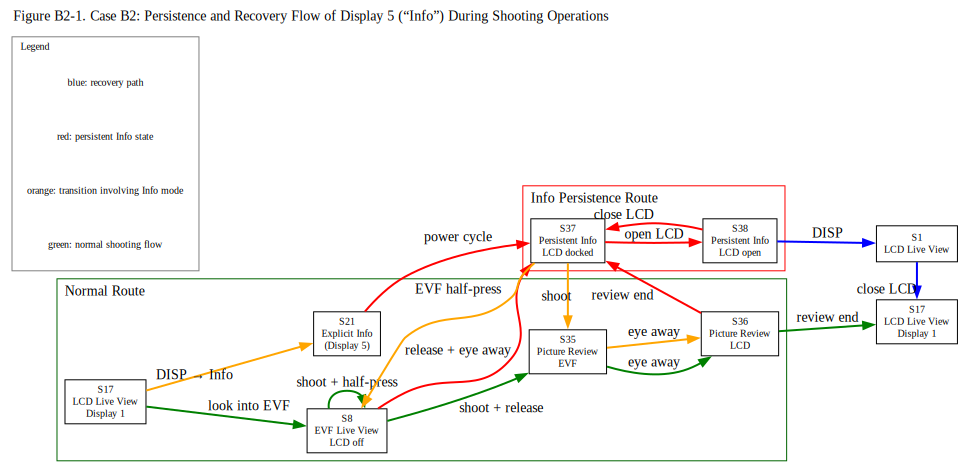
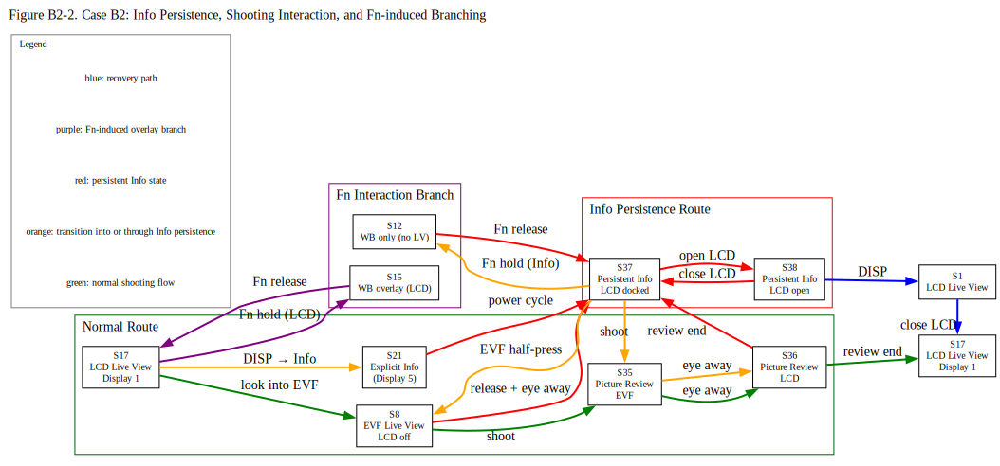

# Case B2: In the Fray of the Focus (Firmware Ver. 3.01)

## Revision History
| Rev. | Date | Description |
| :--- | :--- | :--- |
| 1.0 | 2026-05-11 | Initial report. |
| 1.1 | 2026-05-14 | Refined operational assessment criteria (E/N/M) and added display-control context definitions to distinguish user-observable behavior from inferred display-control consistency. |
| 1.2 | 2026-05-17 | Added Figure 1, Observational Notes.|
| 1.3 | 2026-05-19 | Added Operational Notes.|
| 1.4 | 2026-05-21 | Added state definitions S37 and S38, and revised S6, S7, S21, and S25. Concurrently updated the relevant tables. |
| 1.5 | 2026-05-22 | Added state definitions S39 and S42, and revised S6, S7, S21, S37 and S38. Concurrently updated the relevant tables. |

---

## 1. Core Observation

*   **Phenomenon:**
    - Up to this point, observations were limited to states prior to actual shooting. This time, chronological observations were conducted on the displayed information during shooting for both the LCD and the EVF.
    - Furthermore, observations were expanded beyond single-frame shooting to include continuous shooting.
    - As a result, phenomena such as the "Info display" continuously remaining on the LCD even during continuous shooting were observed.
*   **Core Issue:**
    During shooting—especially during continuous burst—the Info display can remain persistently on the LCD, demonstrating that the information overlay logic functions independently of real-time image capture states.

### Figure B2-1, B2-2

Source: [`Case_B2_Figure1.dot`](../../figures/Case_B2_Figure1.dot)

This figure highlights that the persistent Info state was not merely an idle-display condition. During shooting operations, including continuous shooting, EVF Live View could appear while the shutter was half-pressed or shooting was in progress, yet the display returned to persistent Info when the eye was removed from the EVF or when picture review ended.

Source: [`Case_B2_Figure2.dot`](../../figures/Case_B2_Figure2.dot)

---

## 2. Preparation and Settings

1. Begin with the LCD monitor docked (folded into the body) with the screen facing you.
2. Initialize all camera settings.
3. Attach a native Z-mount lens, an F-mount lens via FTZ, or a non-CPU manual focus lens, and remove the lens cap, as no lens-specific variations were observed in my scope of testing.
4. Use the Monitor mode button to set it to **Automatic display switch** (default).
5. In [CUSTOM SETTINGS MENU] > [d19 Custom monitor shooting display], ensure that all displays (Display 1 to 5) are checked and Display 1 is selected (default).
6. To avoid interference with the verification process, adjust the shutter speed as necessary so that it remains faster than approximately 1/60 s.
7. Power off.
8. Insert a high-capacity, writable card.

---

## 3. Experimental Contexts
### Display Control Contexts
- **Context A**
  - [Monitor mode] = Prioritize viewfinder (1 or 2)
  - [Automatic monitor display switch] = On (when monitor docked)
- **Context B**
  - [Monitor mode] = Automatic display switch
  - [Automatic monitor display switch] = On
  - Factory default configuration
- **Context C**
  - [Monitor mode] = Monitor only
- **Context D**
  - [Monitor mode] = Prioritize viewfinder (1 or 2)
  - LCD monitor inactive due to EVF priority activation
- **Context E**
  - [Monitor mode] = Automatic display switch
  - [Automatic monitor display switch] = On (when monitor docked)

> [!NOTE]
> **Context D** represents a temporary display-routing condition in which Live View is assigned to the EVF and the LCD monitor becomes inactive due to EVF-priority behavior. Under this condition, previously observed Info persistence behavior was not maintained while Live View routing remained EVF-active.

### Assessment Codes
> For details on the evaluation ratings (E / N / M), please refer to the [Assessment Codes](../../README.md#assessment-codes) in the main README.

---

## 4. State Transition Table (Definition B)

> [!NOTE]
> Some states defined in this document are visually indistinguishable
> from one another, yet exhibit different operational behavior
> depending on prior display-routing history and monitor context.

> [!NOTE]
> In the following tables, display overlays are abbreviated as
> “DP1” through “DP5”, corresponding to the selectable display modes
> configured under [d19 Custom monitor shooting display].

> For example:

> - “Live View (with DP1)” indicates Live View with Display 1 overlay.

### Operational Notes

- Unless otherwise specified, “Open LCD monitor” refers to opening the monitor to at least 20° but less than 140° (to avoid entering self-portrait mode), while keeping the LCD active and allowing viewfinder status checks without triggering the eye sensor.

- Unless otherwise specified, keep your eye and other objects away from the viewfinder to prevent eye sensor activation.

- Unless otherwise specified, perform each operation with an interval of at least three seconds between actions.

- Throughout this table, “closing the LCD” refers to returning the monitor to the docked position with the screen facing the user, as defined in the initial setup.

- WB = White balance.

| Step | Current State | Operation                                                                     | Next State | LCD Status                                     | EVF Status                                 | My Assessment                                | Your Assessment              |
| :--- | :------------ | :---------------------------------------------------------------------------- | :---------- | :-------------------------------------------- | :----------------------------------------- | :------------------------------------------- | :--------------------------- |
| Context B                                                                                                                                |            |                                                                                               |                   |                                              |                   |                              |                 |
| 1    | S0             | Power on                                                                     | S17         | Live View (with DP1)          | Off                                        |   E   | E / N / M |
| 2    | S17            | In [PHOTO SHOOTING MENU] > [Release mode], select Continuous H, then exit    | S17         | Live View (with DP1)          | Off                                        |   E   | E / N / M |
| 3    | S17            | Look into the EVF, Half-press shutter button, get ready to shoot immediately | S8          | Nothing display                               | Live View (with DP1)       |   E   | E / N / M |
| 4    | S8             | Press the shutter button to initiate continuous release   for the initial five seconds, maintaining appropriate pressure throughout | S8         | Nothing display                               | Live View (with DP1)          |   E   | E / N / M |
| 5    | S8             | Without lifting finger from the shutter button, move eye away from EVF   and continue continuous release for an additional five seconds. | S17         | Live View (with DP1)          | Off                                        |   E   | E / N / M |
| 6    | S17            | Without lifting finger from the shutter button, look into the EVF   for the final five seconds | S8          | Nothing display                               | Live View (with DP1)       |   E   | E / N / M |
| 7    | S8             | Lift finger from the shutter button                                         | S8          | Nothing display                               | Live View (with DP1)       |   E   | E / N / M |
| 8    | S8             | Move eye away from EVF                                                      | S17         | Live View (with DP1)          | Off                                        |   E   | E / N / M |
| 9    | S17            | Power off, then on                                                          | S17         | Live View (with DP1)          | Off                                        |   E   | E / N / M |
| 10   | S17            | Press DISP button repeatedly until Display 5=Info is shown                  | S21         | Info display (explicit DISP route; DP5 ON)    | Off                                        |   E   | E / N / M |
| 11   | S21            | Power off, then on                                                          | S37         | Info display (persistent fixation)            | Off                                        | **N** | E / N / M |
| 12   | S37            | Look into the EVF, Half-press shutter button, get ready to shoot immediately | S8         | Nothing display                               | Live View (with DP1)       |   E   | E / N / M |
| 13   | S8             | Press the shutter button to initiate continuous release   for the initial five seconds, maintaining appropriate pressure throughout | S8         | Nothing display                               | Live View (with DP1)          |   E   | E / N / M |
| 14   | S8             | Without lifting finger from the shutter button, move eye away from EVF   and continue continuous release for an additional five seconds. | S37        | **Info display**                              | Off                                        | **N** | E / N / M |
| 15   | S37            | Without lifting finger from the shutter button, look into the EVF   for the final five seconds | S8          | Nothing display                               | Live View (with DP1)       |   E   | E / N / M |
| 16   | S8             | Lift finger from the shutter button                                          | S8          | Nothing display                               | Live View (with DP1)       |   E   | E / N / M |
| 17   | S8             | Move eye away from EVF                                                       | S37         | Info display (persistent fixation)            | Off                                        | **N** | E / N / M |
| 18   | S37            | Open LCD monitor                                                             | S38         | Info display (persistent fixation)            | Off                                        | **N** | E / N / M |
| 19   | S38            | Press the DISP button                                                        | S1          | Live View (with DP1)          | Off                                        |   E   | E / N / M |
| 20   | S1             | Close LCD monitor                                                            | S17         | Live View (with DP1)          | Off                                        |   E   | E / N / M |
| 21   | S17            | In [PHOTO SHOOTING MENU] > [Release mode], select Single frame, then exit    | S17         | Live View (with DP1)          | Off                                        |   E   | E / N / M |
| 22   | S17            | In [CUSTOM SETTINGS MENU] > [c3 Power off delay] >[Picture review], select 20 s;   In [PLAYBACK MENU] > [Picture review], select On, then exit   | S17          | Live View (with DP1)          | Off                                        |   E   | E / N / M |
| 23   | S17            | Power off, then on                                                           | S17         | Live View (with DP1)          | Off                                        |   E   | E / N / M |
| 24   | S17            | Look into the EVF, Half-press shutter button, get ready to shoot immediately | S8          | Nothing display                               | Live View (with DP1)       |   E   | E / N / M |
| 25   | S8             | Take a photo and hold the shutter halfway, don't ease up even for a second   | S8          | Nothing display                               | Live View (with DP1)       |   E   | E / N / M |
| 26   | S8             | While holding the shutter halfway, press and hold the Fn button              | S16         | Nothing display                               | Live View with the WB adjustment overlay   |   E   | E / N / M |
| 27   | S16            | While holding the shutter halfway, release the Fn button                     | S8          | Nothing display                               | Live View (with DP1)       |   E   | E / N / M |
| 28   | S8             | Lift finger from the shutter button                                          | S35         | Nothing display                               | Picture Review display                     |   E   | E / N / M |
| 29   | S35            | Wait 3 s; then move eye away from EVF                                        | S36         | Picture Review display                        | Off                                        |   E   | E / N / M |
| 30   | S36            | Wait for the Picture Review to disappear and the next screen to appear       | S17         | Live View (with DP1)          | Off                                        |   E   | E / N / M |
| 31   | S17            | Half-press shutter button, get ready to shoot immediately                    | S17         | Live View (with DP1)          | Off                                        |   E   | E / N / M |
| 32   | S17            | Take a photo and hold the shutter halfway, don't ease up even for a second   | S17         | Live View (with DP1)          | Off                                        |   E   | E / N / M |
| 33   | S17            | While holding the shutter halfway, press and hold the Fn button              | S15         | Live View with the WB adjustment overlay      | Off                                        |   E   | E / N / M |
| 34   | S15            | While holding the shutter halfway, release the Fn button                     | S17         | Live View (with DP1)          | Off                                        |   E   | E / N / M |
| 35   | S17            | While holding the shutter halfway, press the DISP button                     | S17         | Live View (with DP1)          | Off                                        |   E   | E / N / M |
| 36   | S17            | Lift finger from the shutter button                                          | S36         | Picture Review display                        | Off                                        |   E   | E / N / M |
| 37   | S36            | Wait for the Picture Review to disappear                                     | S17         | Live View (with DP1)          | Off                                        |   E   | E / N / M |
| 38   | S17            | Press DISP button repeatedly until Display 5=Info is shown                   | S21         | Info display (explicit DISP route; DP5 ON)    | Off                                        |   E   | E / N / M |
| 39   | S21            | Power off, then on                                                           | S37         | Info display (persistent fixation)            | Off                                        | **N** | E / N / M |
| 40   | S37            | Look into the EVF, Half-press shutter button, get ready to shoot immediately | S8          | Nothing display                               | Live View (with DP1)       |   E   | E / N / M |
| 41   | S8             | Take a photo and hold the shutter halfway, don't ease up even for a second   | S8          | Nothing display                               | Live View (with DP1)       |   E   | E / N / M |
| 42   | S8             | While holding the shutter halfway, press and hold the Fn button              | S16         | Nothing display                               | Live View with the WB adjustment overlay   |   E   | E / N / M |
| 43   | S16            | While holding the shutter halfway, release the Fn button                     | S8          | Nothing display                               | Live View (with DP1)       |   E   | E / N / M |
| 44   | S8             | Lift finger from the shutter button                                          | S35         | Nothing display                               | Picture Review display                     |   E   | E / N / M |
| 45   | S35            | Wait 3 s; Move eye away from EVF                                             | S36         | Picture Review display                        | Off                                        |   E   | E / N / M |
| 46   | S36            | Wait for the Picture Review to disappear                                     | S37         | Info display (persistent fixation)            | Off                                        | **N** | E / N / M |
| 47   | S37            | Half-press shutter button, get ready for a blind shot.                       | S37         | Info display (persistent fixation)            | Off                                        | **N** | E / N / M |
| 48   | S37            | Take a photo and hold the shutter halfway, don't ease up even for a second   | S37         | Info display (persistent fixation)            | Off                                        | **N** | E / N / M |
| 49   | S37            | While holding the shutter halfway, press and hold the Fn button              | S12         | Only the WB adjustment overlay                | Off                                        | **M** | E / N / M |
| 50   | S12            | While holding the shutter halfway, release the Fn button                     | S37         | Info display (persistent fixation)            | Off                                        | **N** | E / N / M |
| 51   | S37            | While holding the shutter halfway, press the DISP button                     | S37         | Info display (persistent fixation)            | Off                                        | **M** | E / N / M |
| 52   | S37            | Lift finger from the shutter button                                          | S36         | Picture Review display                        | Off                                        |   E   | E / N / M |
| 53   | S36            | Wait for the Picture Review to disappear                                     | S37         | Info display (persistent fixation)            | Off                                        | **N** | E / N / M |

---

### Observational Notes

Persistence of the Info display was observed even under default configuration conditions.

In the factory-default configuration, both entry into and exit from the persistent Info-display state appeared to rely on DISP-related display cycling. This raises the possibility that users may unintentionally perform recovery operations during ordinary camera use without recognizing the underlying persistence behavior.

The present observation additionally confirmed that persistent Info-display states could occur not only before or after shooting operations, but also during continuous shooting sequences.

---

### Observed Recovery Paths

The following operations were observed to terminate,
bypass, or prevent persistent Info-display states
under at least some tested conditions:

- Pressing DISP while the LCD monitor remained active
- Reassigning the "DISP Cycle view info display" function
  to a custom button and then pressing it
  (not to be confused with "Live view info display off")
- Disabling "Display 5" in:
  [CUSTOM SETTINGS MENU] >
  [d19 Custom monitor shooting display]
- Initializing camera settings

